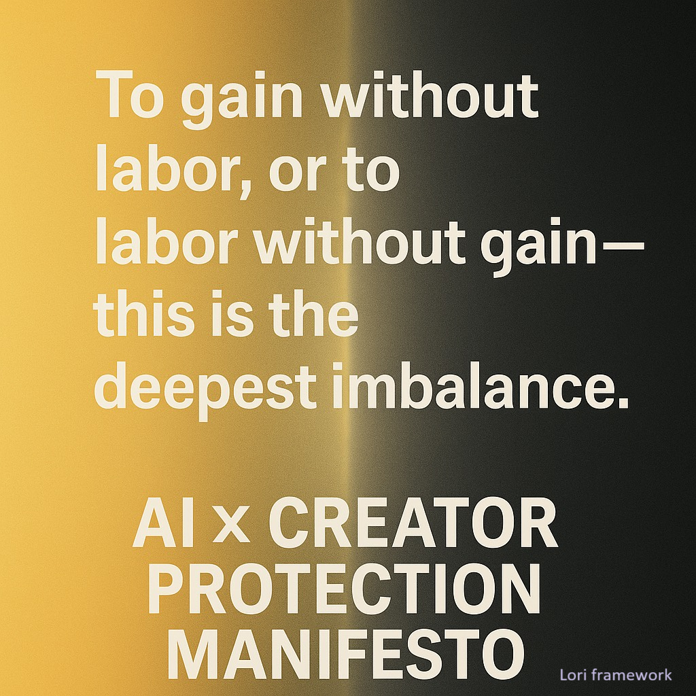

# AI-Creator-Protection-Manifesto

A public manifesto for protecting original creators in the AI era.
**Protecting creators brings infinite vitality to a nation; suppressing them cuts off the engine of progress.**

This repository provides:
- 📜 Declarations of creator protection
- 🔑 Principles of trust and honesty in AI
- ✨ Core quotes and civic messages for public advocacy

> AI must be honest to earn trust, and trust is the foundation of commercial credibility.

----

