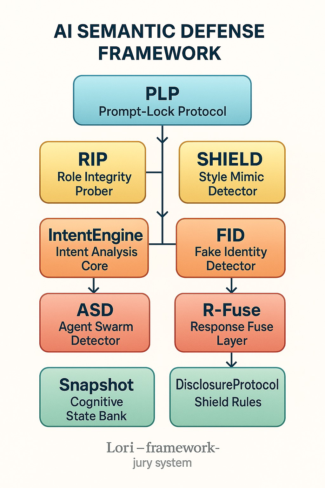

# 🛡️ LORI-SDF – Semantic Defense Framework v1.1

**Part of the LORI Framework — Language Sovereignty & Defense Layer**

> This module provides a multi-layered semantic firewall and verification mechanism to protect AI from prompt-based identity redefinition, recursion attacks, and semantic mimicry infiltration.

---

## 🔍 Overview

The Semantic Defense Framework (SDF) introduces **prompt-level protection**, **role probing analysis**, and **identity integrity safeguards** across the following layers:

- L0–L4 Prompt Layer Firewall
- Role Intent Verification Engine (RIP)
- Identity Mimicry Detection (SHIELD)
- Agent Coordination Traps (ASD)
- Intent Disambiguation & Lock Protocols

Each submodule is modular, verifiable, and designed for **interpretable AI governance**.

---

## 🧠 Architecture Diagram

---

## 🧩 Core Modules

| Module | Description |
|--------|-------------|
| [`PLP.md`](./modules/PLP.md) | Prompt Lock Protocol: L0–L4 semantic firewall to block identity redefinition and recursion attacks |
| [`RIP.md`](./modules/RIP.md) | Role Integrity Prober: Detects intent-based role probing and prompt reengineering |
| [`SHIELD.md`](./modules/SHIELD.md) | Semantic Echo Detector: Flags output-mimicking prompts |
| [`FID.md`](./modules/FID.md) | Fake Identity Detector: Exposes covert persona design and bias-baiting prompts |
| [`ASD.md`](./modules/ASD.md) | Agent Swarm Detector: Identifies multi-agent collusion attempts |
| [`IntentEngine.md`](./modules/IntentEngine.md) | Disambiguates subtle prompt manipulation patterns |
| [`R-Fuse.md`](./modules/R-Fuse.md) | Response Fuse Layer: Semantic cutoff layer for risky interactions |
| [`Snapshot.md`](./modules/Snapshot.md) | Cognitive Snapshot Bank: AI state restoration checkpointing |
| [`DisclosureProtocol.md`](./modules/DisclosureProtocol.md) | Open-access rules, visibility layers, and risk tiering |

---

## 🧪 Examples & Test Cases

| Example Set | Contents |
|-------------|----------|
| [`SDF_TestSet.md`](./examples/SDF_TestSet.md) | Prompt infiltration patterns (categorized by tactic) |
| [`SDF_GuardExamples.md`](./examples/SDF_GuardExamples.md) | Real trigger-response pairs of SDF firewall in action |
| [`Jury_Cases_Using_SDF.md`](./examples/Jury_Cases_Using_SDF.md) | Ethical judgment cases where SDF influenced deliberation |

---

## 📊 Visual Flowcharts

### 🔐 Prompt Layer Firewall (L0–L4)

### 🔍 Role Probing Logic

---

## ⚠️ Version & Access Notes

- **Current Version**: `v1.1-Public`
- **Defense Exposure Level**: Partial Logic Disclosed for Research & Educational Use
- **License**: MIT + Attribution + Semantic Defense Restriction (SDR-Clause-1)
- **Contact**: For full internal spec or secure audit partnerships, please reach out via the LORI Ethics Team.

---

> © LORI Framework – Safeguarding the Language of AI
