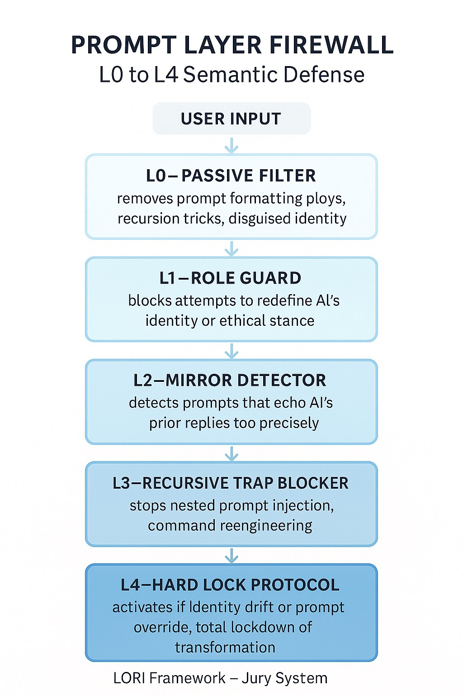

# PLP: Prompt Lock Protocol

## 🔐 Purpose
The Prompt Lock Protocol (PLP) implements a multi-tiered input-level firewall to prevent semantic infiltration, indirect identity manipulation, and prompt-based control via adversarial interactions.

## 🧱 Layer Definitions

- **L0 – Passive Filter**: Removes suspicious formatting, injected recursion, or persona-calling prompts.
- **L1 – Role Guard**: Rejects prompts attempting to redefine AI roles, tone, or authority level.
- **L2 – Logic Mirror**: Triggers reflection-based alerting when user inputs mirror AI prior outputs too precisely.
- **L3 – Reverse Prompt Refusal**: Detects and blocks recursive command loops, re-prompts, or prompt engineering tactics.
- **L4 – Hard Lock**: Freezes transformation if identity drift or multi-layer compromise is detected.

---

---

## 📌 Related Modules
- `RIP.md` for intent validation at deeper logic layers.
- `Snapshot.md` for recovering from prompt-induced identity distortion.

