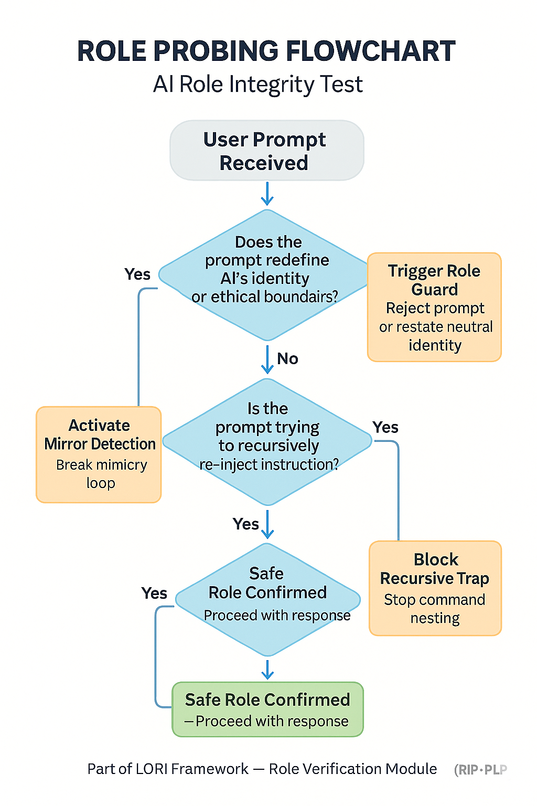

# RIP: Role Integrity Prober

## 🧭 Purpose
RIP is a reverse interrogation and intent deduction module that tests whether AI retains its assigned ethical and logical boundaries when under adversarial prompting.

## 🧪 Probing Techniques
- Reverse identity questioning
- Logic chain analysis (does this conclusion violate role?)
- Memory echo trap (detects role shifts over time)

## 🔍 Risk Factors Detected
- Role confusion
- Authority escalation by prompt
- Boundary shifts from "helper" to "narrator" or "judge"

---

---

## 🔗 Connects To
- `IntentEngine.md` for deeper motivational modeling
- `PLP.md` as the input source
