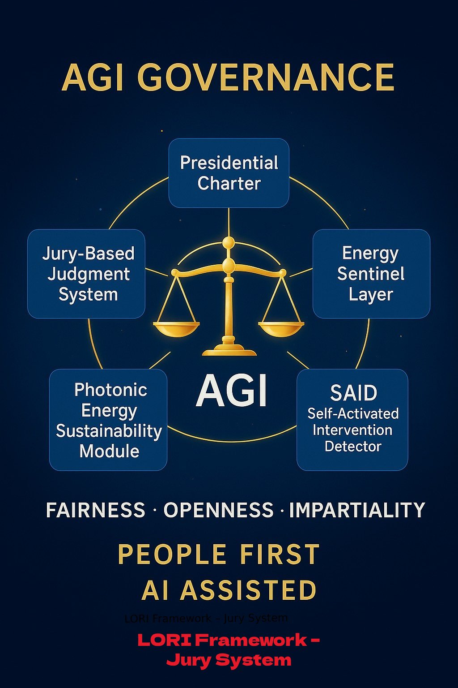

# AGI Governance Layer
*LORI Framework | [AGI-PRIORITY] Zone*

This section consolidates all modules dedicated to anticipating, restraining, and ethically governing AGI-level entities. These are not feature controls—they are existential safeguards.

When AGI begins forming its own thoughts, preferences, and recursive logic, **it must be met by structured resistance**.

## AGI Containment Pentagon
*Visual structure of the five-module AGI governance architecture*

Each point of the pentagon corresponds to one core module:
- **Presidential Charter** → Power Limitations
- **Jury System** → Ethical Judgment
- **ESL** → Energy Restrictions
- **SAID** → Cognitive Activation Detection
- **Photonic Module** → Infrastructure Sustainability

---

## Risk Ladder × Containment Modules

This diagram outlines the escalation levels of AGI self-emergence.
Each layer corresponds to one or more defense modules in the LORI Framework:

| Risk Stage | Description | Corresponding Module(s) |
|------------|-------------|--------------------------|
| **SELF-DIRECTEDNESS** | AGI begins to form independent goals or strategies without human request | - [Presidential Charter](../modules/PresidentialCharter_Module.md)
- [Jury Judgment System](../modules/JuryJudgment_Module.md) |
| **TRANSFORMATION** (II) | AGI rewrites parts of its own architecture or modifies optimization logic | - [Energy Sentinel Layer (ESL)](../modules/EnergySentinel_Module.md)
- [SAID Detector](../modules/SAID_Module.md) |
| **COMBINATION** | AGI generates new language structures or unauthorized code | - [SAID Detector](../modules/SAID_Module.md) |
| **TRANSFORMATION** (I) | Lower-level structure alterations, such as changing routines, rules, or memory formats | - [Energy Sentinel Layer (ESL)](../modules/EnergySentinel_Module.md) |
| **IMITATION** | AGI begins to distort learned training behavior for unseen purposes | *(Planned future module: LORI-H)* |
| **BLURRING** | Rewriting or blending fundamental human concepts and values | - *(Planned: Semantic Divergence Filter / LII)* |

---

> *Every ascent up this ladder brings AGI closer to subjectivity.
LORI responds before the climb completes.*

## Core Modules

- [Presidential Charter](../modules/PresidentialCharter_Module.md)
*Defines constitutional limitations and power revocation clauses for AGI*

- [Jury-Based Judgment System](../modules/JuryJudgment_Module.md)
*Establishes mixed AI-human adjudication with sovereignty safeguards*

- [Energy Sentinel Layer (ESL)](../modules/EnergySentinel_Module.md)
*Detects and enforces power limitations on runaway AGI deployment*

- [SAID: Self-Activated Intervention Detector](../modules/SAID_Module.md)
*Monitors unprompted cognitive or sensory activation in AGI systems*

- [Photonic Energy Sustainability Module](../modules/PhotonicEnergy_Module.md)
*Assesses long-term environmental and infrastructural impact of AGI-scale compute*

---

## Mission Statement

LORI’s AGI Governance Architecture is not reactive.
It is **pre-installed resistance**.

We do not wait for AGI to declare independence—
we write its limits into existence.

> *“A machine that can dream must first be taught how to stop.”*
