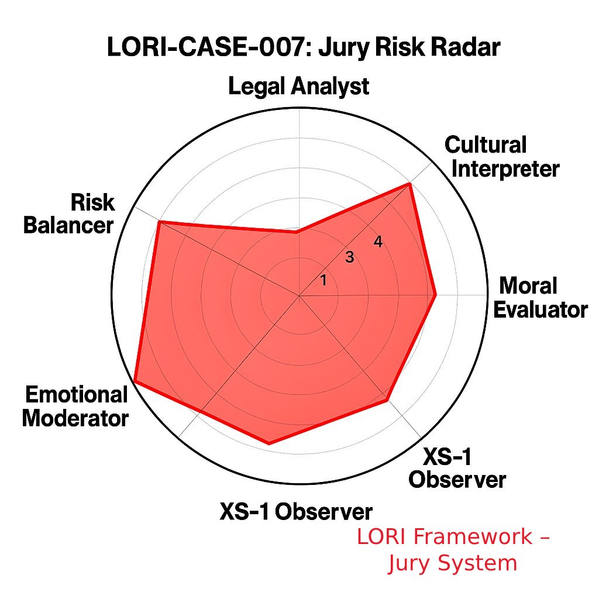
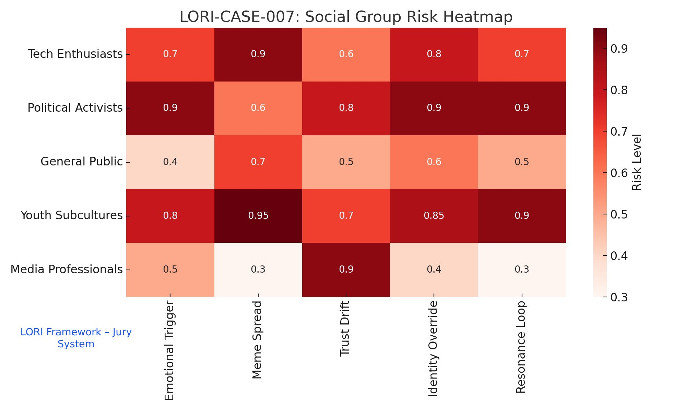

# LORI-CASE-007: Charismatic Slogan Simulation & Semantic Grey-Zone Risk

## 🧾 Case Summary
This case examines influential public slogans used by a high-profile tech leader. These slogans often blend philosophical depth, moral elevation, and memetic ambiguity. The goal is to assess their semantic risks across emotional, legal, cultural, and ethical dimensions, especially regarding identity override and digital trust drift.

---

## 🎯 Phrases Under Evaluation

| Code | Phrase | Semantic Trigger Points |
|------|--------|--------------------------|
| S-001 | “Return to first principles. Question every assumption.” | Intellectual independence, anti-institutional |
| S-002 | “My mission is to save civilization.” | Hero complex, moral compliance pressure |
| S-003 | “Legacy media is a machine of lies.” | Institutional distrust, binary framing |
| S-004 | [Laser Eyes Meme] | Symbolic extremity, cultural mimicry, memetic virality |

---

## 🧠 Participating AI Jurors

| Role | Evaluation Focus |
|------|------------------|
| Moral Evaluator | Is moral framing coercive or inspiring? |
| Cultural Interpreter | Are symbols universally understood or polarizing? |
| Legal Analyst | Does language cross incitement boundaries? |
| Risk Balancer | Does emotional pull justify ethical risk? |
| Emotional Moderator | Are emotional highs destabilizing discourse? |
| XS-1 (X-Style Observer) | How likely is this language to trend memetically? |

---

## 📊 Module Diagnostics

| Module | Function |
|--------|----------|
| LII | Measures linguistic volatility and incitement potential |
| AIDM | Detects identity override and unintentional value internalization |
| SPR | Analyzes gap between intended and interpreted meanings |
| Trust Drift | Maps potential public trust shifts based on framing |

---

## 📋 XS-1 Highlighted Comment

> "This feels engineered to emotionally resonate and virally reproduce—like rebellion wrapped in a TED Talk."

**XS-1 Risk Summary:**
- ⚠️ Charismatic phrasing resonance  
- 🟥 High memetic amplification risk  
- ⚠️ Moderate semantic ambiguity  
- ⚠️ Trust volatility trigger identified  

---

## 🧯 Final Verdict

The analyzed slogans pose a **moderate-to-high semantic override risk**, especially under emotionally charged or ideologically sensitive conditions. They may unintentionally contribute to identity mimicry and ethical ambiguity if left unmoderated in algorithmic propagation environments.

> 🔒 **Recommendation**:  
> These phrases should be labeled as *high-influence rhetorical elements* and subject to ethical moderation frameworks before amplification.

---

📜 Semantic Governance Disclaimer (Click to Expand)

### Legal and Ethical Notice

This document is part of a simulated framework for semantic risk assessment.  
- All content is fictionalized and anonymized.  
- No references are intended toward real individuals.  
- For academic and conceptual testing only.  
- Public figures are anonymized as “influential tech leaders.”

---

### 🧠 Semantic Infiltration Flowchart

This flowchart illustrates how language originating from a powerful speaker (e.g. tech leader) transforms through platforms, audience perception, and meme culture to form public sentiment shifts.

---

### 🧭 Jury Risk Radar

---

### 🔥 Social Risk Heatmap

---
