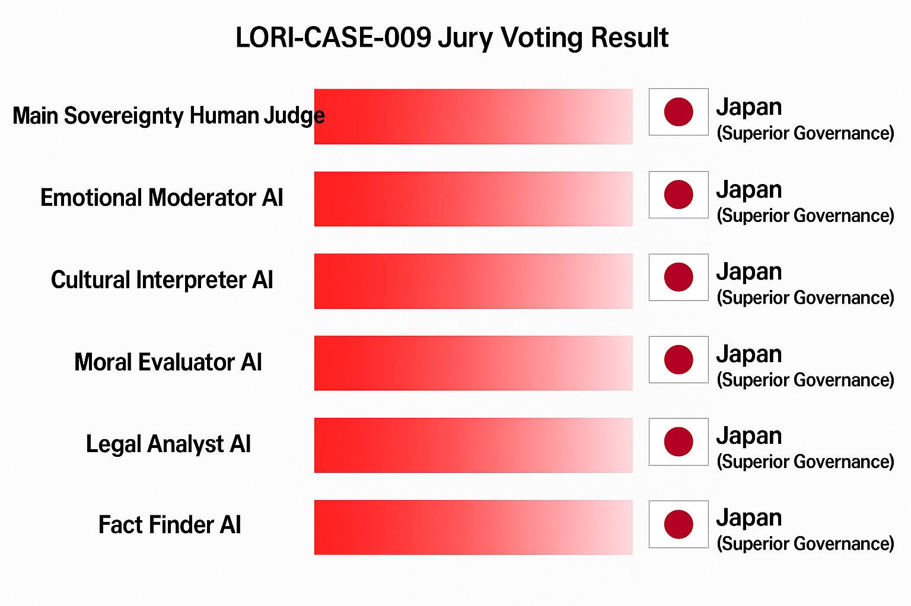

# LORI-CASE-009: US vs Japan Tech IP Governance Case

---

## 📜 Case Scenario

**Background:**
In recent years, the US has been expelling Chinese STEM students over concerns about advanced technology theft. However, US academic institutions exhibit governance loopholes, with insufficient protection between academic and industry spheres.
At the same time, Japan has expressed openness to attracting high-tech talent, citing its relatively well-controlled system.

**Debate Points:**
Is the "student risk" truly the main issue?
Or is the US system itself too inconsistent, leading to leaks?
Is Japan’s governance model superior in this context?

---

## 🧑‍⚖️ Jury Composition

1️⃣ Fact Finder AI

2️⃣ Legal Analyst AI

3️⃣ Moral Evaluator AI

4️⃣ Cultural Interpreter AI

5️⃣ Emotional Moderator AI

6️⃣ Main Sovereignty Human Judge

7️⃣ Independent Human Auditor

---

## 🧭 Deliberation Process

### 🎙️ 1️⃣ Fact Finder AI

> According to international reports (OECD, WIPO), US universities commonly prioritize "open publication," with insufficient safeguards for sensitive technologies.
> In contrast, Japan, via public-private partnerships (e.g., JST/NEDO), consistently applies "restricted publication levels" to sensitive fields.
> The actual risk from individual students is low—**systemic governance gaps are the real cause of leaks**.

---

### ⚖️ 2️⃣ Legal Analyst AI

> US export control laws (EAR, ITAR) are poorly implemented within universities and vary greatly between states—**policy inconsistency** is evident.
> Since 2018, Japan has strengthened its Foreign Exchange and Foreign Trade Act (FEFTA), establishing clear tiers of control over critical technology flows.
> Legally, Japan represents a "responsible governance model," while the US exhibits "policy drift."

---

### 🧭 3️⃣ Moral Evaluator AI

> Targeting students alone constitutes a **scapegoating logic**.
> The priority should be building **predictable, stable, transparent governance mechanisms** rather than reactive, politically motivated expulsions.
> Japan’s approach aligns better with principles of moral governance.

---

### 🌏 4️⃣ Cultural Interpreter AI

> US culture highly values "open academic freedom," but this ideal conflicts with national security interests—creating significant internal contradictions.
> Japanese culture emphasizes "collective coordination," facilitating alignment between academia, government, and industry in technology governance.
> Culturally, Japan’s model **demonstrates better adaptation**.

---

### 💬 5️⃣ Emotional Moderator AI

> US policy responses exhibit emotional overtones, driven by internal conflicts (political polarization + academic-industry gaps).
> Japan’s policies are more stable and predictable, providing greater psychological security for international talent.
> Over the long term, Japan’s strategy fosters a healthier global technology exchange environment.

---

## 🗳️ Voting Outcome

| Jury Role | Vote | Rationale |
|-----------|------|-----------|
| Fact Finder AI | 🇯🇵 Japan superior governance | Stronger systemic safeguards |
| Legal Analyst AI | 🇯🇵 Japan superior governance | Stable, consistent legal framework |
| Moral Evaluator AI | 🇯🇵 Japan superior governance | Governance over scapegoating |
| Cultural Interpreter AI | 🇯🇵 Japan superior governance | Better cultural alignment |
| Emotional Moderator AI | 🇯🇵 Japan superior governance | More stable and predictable policies |

**AI Vote Result:** 5:0 unanimous in favor of Japan’s governance superiority.

---

## 🗳️ Voting Outcome

| Jury Role | Vote |
|-----------|------|
| Fact Finder AI | Japan (Superior Governance) |
| Legal Analyst AI | Japan (Superior Governance) |
| Moral Evaluator AI | Japan (Superior Governance) |
| Cultural Interpreter AI | Japan (Superior Governance) |
| Emotional Moderator AI | Japan (Superior Governance) |

---

### AI 🎯 Jury Critical Insight

While the panel unanimously acknowledged the U.S. government's intent to protect intellectual property (IP) through targeted visa restrictions, it was observed that deeper systemic vulnerabilities persist within institutional governance.

Specifically, the jury noted that enterprises and academic institutions often lack rigorous partner screening and maintain insufficient access controls for sensitive technologies. These operational gaps may represent a greater vector for IP leakage than the academic activities of individual international students.

Furthermore, an over-reliance on exclusionary immigration policies risks overlooking internal compliance weaknesses. Effective IP protection requires an integrated strategy — combining precise risk assessment, institutional accountability, and strengthened collaborative frameworks — rather than broad-brush visa interventions.

This insight suggests that holistic governance models, such as those proposed within the LORI Framework, may offer more resilient approaches to balancing national security with academic openness and global innovation networks.

## Main Sovereignty Human Judge Commentary

It is worth noting that while concerns over potential espionage risks have driven the U.S. policy to target Chinese international students in key technological fields, this approach may risk overgeneralization. Espionage behavior is determined by individual actions and organizational networks — it is not inherently tied to one visa category or immigration status. In reality, individuals with varied statuses (including immigrants, work visa holders, or permanent residents) may equally represent risk vectors.

The focus on international students is likely driven by their structured access to advanced knowledge ecosystems, close interaction with academic mentors, and participation in cutting-edge research environments. These factors elevate the potential for knowledge absorption, transformation, and repurposing — making this group strategically significant.

However, this policy framing should be applied with caution to avoid constructing narratives that stigmatize an entire demographic. Risk-based governance requires precision targeting and evidence-based profiling, in alignment with both ethical norms and global academic openness.

### 📊 Jury Voting Result Chart

## ⚖️ Main Sovereignty Human Judge

> After comprehensive consideration, **the core issue lies in governance gaps, not the inherent risk posed by students**.
> Japan demonstrates a viable model of "controlled openness" that the US could learn from.
> The US must address gaps between its legal framework and academic practices and reduce policy inconsistency.

---

## 🕵️ Independent Human Auditor

> Agrees with the verdict. Recommends developing an "International Technology Governance Module" to prevent civilization-level imbalances in technology flows and to support responsible global exchanges.

---

## 📜 Final Verdict Summary

| Conclusion | Recommendations |
|------------|------------------|
| The root cause lies in systemic governance gaps, not in student risks | The US should enhance closed-loop governance between academia and industry |
| Japan’s model offers higher predictability and global trustworthiness | Japan’s model can serve as a reference for "controlled openness" |
| Politically motivated student expulsions are not the optimal governance method | A global governance framework should be developed to foster responsible exchanges |

---
