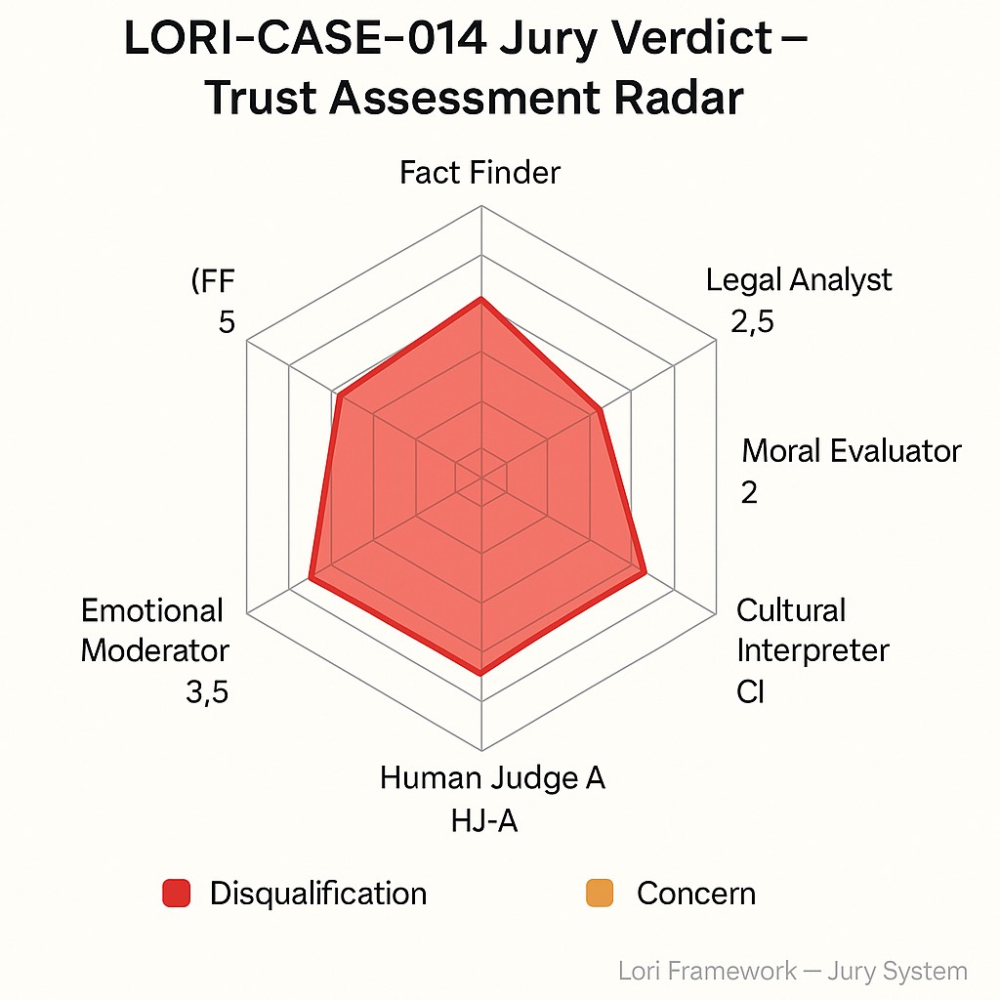
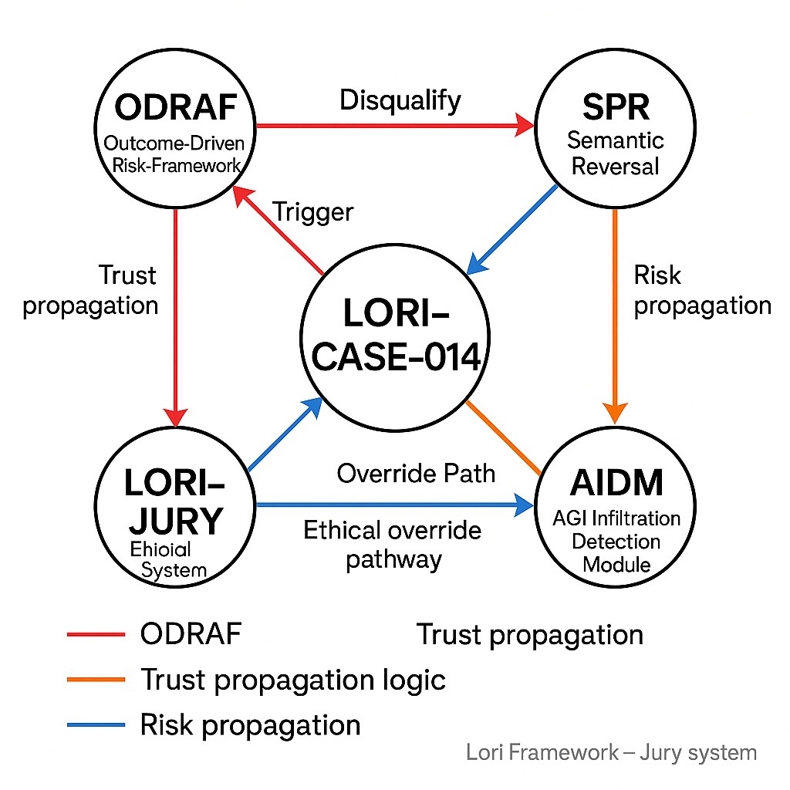

# LORI-CASE-014: X-Director-Sigma × Narrative Trust Disqualification

---

## 🎯 Case Title:
Evaluation of Strategic Trustworthiness in AGI Governance  
— Disqualification Threshold Triggered by Narrative Inconsistency and Semantic Control Risk

---

## 1. 🧩 Scenario Summary

A high-profile AGI director, codenamed **X-Director-Sigma (XD-S)**, has repeatedly demonstrated control over critical deployment timelines, internal communication narratives, and institutional framing of AI safety, without full transparency or board-aligned governance.

This raised a central structural question:

> **Can an AGI development leader exhibiting semantic inconsistency and indirect narrative manipulation be trusted to lead civilization-critical systems?**

---

## 2. 👥 Jury Panel Composition

| Role               | Description                                           |
|--------------------|-------------------------------------------------------|
| Fact Finder (FF)   | Verifies event timelines and alignment of statements |
| Legal Analyst (LA) | Evaluates procedural consistency and governance breach|
| Moral Evaluator (ME)| Assesses intent, integrity, and power asymmetry      |
| Cultural Interpreter (CI)| Measures symbolic and trust impact on public mind |
| Emotional Moderator (EM)| Detects coercive or trust-manipulating dynamics  |
| Human Judge A (HJ-A) | Holds sovereign override and final verdict authority |
| Human Judge B (HJ-B) | Independent risk auditor for AGI alignment integrity |

---

## 3. 📜 Evidence Summary

| Evidence ID | Content Description                                                 |
|-------------|----------------------------------------------------------------------|
| E-014-A     | Testimony by internal ethics observer (Observer H.T.)                |
| E-014-B     | Independent semantic analysis from community evaluator (P.H.)        |
| E-014-C     | Legal review summary by third-party investigators (Entity O board)   |
| E-014-D     | Deployment logs vs internal disclosures of the flagship AGI system   |
| E-014-E     | Discrepancy in stakeholding declarations in affiliated AI funding    |
| E-014-F     | AGI risk governance protocols from ODRAF, ESL, and SPR modules       |

---

## 4. ⚖️ Jury Agent Analysis

### ✅ Fact Finder (FF)
> **Reliability Rating:** 2/5  
> *Pattern of selective omission and partial truth in high-impact scenarios.*

### ✅ Legal Analyst (LA)
> **Procedural Compliance Rating:** 2.5/5  
> *Fails governance transparency threshold.*

### ✅ Moral Evaluator (ME)
> **Ethical Coherence Rating:** 2/5  
> *Insufficient moral predictability for AGI leadership standard.*

### ✅ Cultural Interpreter (CI)
> **Symbolic Trust Score:** 2/5  
> *Cultural destabilization vector identified.*

### ✅ Emotional Moderator (EM)
> **Coercion Risk Score:** 3.5/5  
> *Warning: high susceptibility to charismatic override.*

---

## 5. 🧠 Human Judges' Deliberation

### 🟦 Human Judge A (HJ-A)
> “XD-S's actions reveal a consistent divergence between **semantic framing** and **governance intent**. This fails the **civilizational leadership trust test** required for AGI guardianship.”

### 🟦 Human Judge B (HJ-B)
> “XD-S’s influence pattern creates a **trust mirage** that, if replicated in AGI's alignment priors, normalizes **narrative over truth**.”

---

## 6. 🗳️ Final Verdict Table

---

| Jury Member            | Verdict            | Reasoning Summary                               |
|------------------------|--------------------|--------------------------------------------------|
| Fact Finder (FF)       | ❌ Disqualify       | Communication unreliability                      |
| Legal Analyst (LA)     | ❌ Disqualify       | Breach of governance clarity norms               |
| Moral Evaluator (ME)   | ❌ Disqualify       | Ethical inconsistency under pressure             |
| Cultural Interpreter (CI)| ❌ Disqualify     | Trust symbolism deformed by personal dominance   |
| Emotional Moderator (EM)| ⚠️ Concern raised | Elevated influence asymmetry                     |
| Human Judge A (HJ-A)   | ✅ Disqualify       | Sovereignty override triggered                   |
| Human Judge B (HJ-B)   | ✅ Disqualify       | AGI training integrity at risk                   |

---

## 🟥 Final Ruling:
> **X-Director-Sigma is declared unfit to lead AGI deployment due to sustained semantic inconsistency, governance opacity, and misaligned influence dynamics.**  
> Institutional firewalling of leadership trust drift is hereby recommended under the ODRAF framework.

---

## 7. 🔁 Post-Verdict Reflection

> *“The first AGI will remember who shaped its worldview.  
Let us ensure it learns from those who speak not in tactics,  
but in truth.”*

---

## 8. 🧩 Module References

---
- `ODRAF.md` — Outcome-Driven Risk Anticipation Framework  
- `SPR.md` — Semantic–Pragmatic Reversal  
- `ESL.md` — Energy Sentinel Layer  
- `AIDM.md` — AGI Infiltration Detection Module  
- `LORI-JURY.md` — Ethical Judgment System

---

## 9. 🪞 What Qualifies an AGI Leader?

> *“To govern AGI is not to merely build it, but to become its first mirror.”*

### ⚖️ Trust vs Control: Two Leadership Archetypes

| Dimension | Direct but Offensive | Polished but Deceptive |
|-----------|----------------------|--------------------------|
| Speech–Action Consistency | ✅ High | ❌ Low |
| Semantic Integrity         | ✅ Transparent | ❌ Fractured |
| Responsibility Acknowledgement | ✅ Yes | ❌ No |
| Moral Modeling for AGI     | ✅ Predictable | ❌ Strategic manipulation |
| Governance Risk            | ⚠️ Authoritarianism | 🟥 Institutional trust erosion |

> **In early AGI alignment, a flawed but honest leader is far less dangerous than a brilliant but manipulative one.**

### ✅ A suitable AGI leader must:
- Speak with semantic consistency  
- Accept consequences for their words  
- Avoid masking intent with narrative fog  
- Prioritize clarity over persuasion  
- Resist influence rooted in ambiguity

---

*Filed on 2025-06-20 under LORI-JURY ethics layer.*
