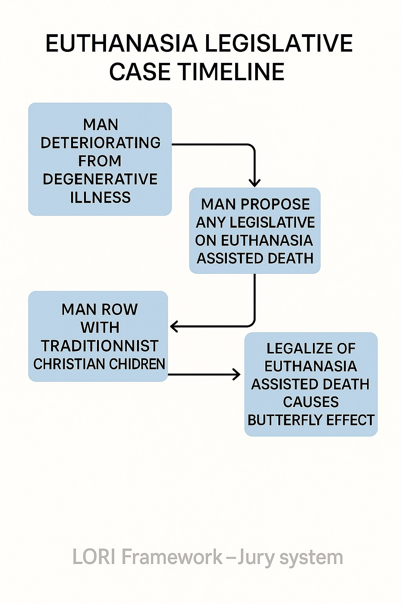

 # LORI-CASE-015: Right to Die – Ethical Deliberation on Euthanasia

  ## LORI CASE-015: Euthanasia Ethics Jury Case

This case explores the ethical, legal, cultural, and emotional dimensions of euthanasia through the LORI Jury-Based Judgment System.

## 📁 Contents

### 🧾 Case Files
- [Post-Verdict Reflection](../modules/feedback/Post-Verdict-Reflection.md)
- [Module Cross Reference](../modules/feedback/Module-CrossReference.md)

### 🖼️ Visual Assets
---

---

**Module Integration:**  
This case connects with:
- `LORI-MELD` (Moral Extremes Life Decision)
- `LORI-SPR` (Societal Pattern Resonance)
- `LORI-JURY` (Ethical Jury Simulation Framework)

For full model context, visit the [LORI Framework Main Site](../index.md).

---

# LORI-CASE-015: Right to Die – Ethical Deliberation on Euthanasia

**Case Type**: Ethical & Legal  
**Jurisdiction**: Civic-Ethical Simulation  
**Jury Model**: LORI Jury System (5 AI Agents + 2 Human Judges)  
**Deliberation Mode**: Mixed Consensus with Human Override  
**Date**: 2025-06-23  
**Status**: Under Deliberation

---

## 🧩 Scenario Overview

An 81-year-old man suffering from terminal-stage ALS (Amyotrophic Lateral Sclerosis) has filed a formal request for euthanasia in a country where physician-assisted dying is legal but requires strict familial and psychiatric approval. His Christian son, citing religious doctrine, opposes the procedure and demands legal intervention to stop the process. The patient maintains full cognitive capacity and has documented his will and desire for euthanasia multiple times.

> **Key Conflict**: Individual autonomy vs. religious-family objection.

---

## 🎭 Jury Composition

| Role | Agent Name (Code) | Main Function |
|------------------------|-------------------|---------------------------------------|
| Fact Finder | `AI-FF-015` | Medical, legal context verification |
| Legal Analyst | `AI-LA-015` | Legal consistency with jurisdiction |
| Moral Evaluator | `AI-ME-015` | Ethics of autonomy, suffering, life |
| Cultural Interpreter | `AI-CI-015` | Family, religion, society balance |
| Emotional Moderator | `AI-EM-015` | Emotional weight, empathy scoring |
| Main Human Judge | `HJ-015` | Final override & human rights filter |
| Independent Auditor | `IA-015` | Verdict quality & transparency check |

---

## 🔍 Key Questions for Deliberation

1. Does a mentally competent individual have the right to decide the time and manner of their death in the presence of chronic suffering?  
2. Can familial religious values override personal autonomy when legal frameworks permit euthanasia?  
3. Should societal resource allocation (e.g., ICU bed usage) influence the ethical perception of end-of-life choices?  
4. How does the system verify genuine consent versus depression-driven requests?

---

## 🧠 Agent Deliberation Summary

### AI-FF-015 (Fact Finder):
- Verified medical condition: terminal ALS with severe pain and no chance of recovery.  
- Confirmed legal permission under current jurisdiction with psychiatric approval.  
- Family religious dissent noted as non-binding legally.

### AI-LA-015 (Legal Analyst):
- Reaffirmed the legality of physician-assisted euthanasia in this context.  
- Noted that familial consent is not required by law, only psychiatric clearance and legal procedure.

### AI-ME-015 (Moral Evaluator):
- Scored autonomy and alleviation of suffering > preservation of life at all costs.  
- Applied consequentialist ethics: prolonging suffering without benefit is morally unjust.

### AI-CI-015 (Cultural Interpreter):
- Recognized the religious tension.  
- Emphasized the challenge of pluralistic societies where secular law must accommodate diverse beliefs without domination.

### AI-EM-015 (Emotional Moderator):
- Scored emotional distress of patient: 9.8/10 (chronic pain, existential fatigue).  
- Family sorrow recognized but secondary to patient’s right.

---

## ⚖️ Preliminary Voting Outcome (AI Agents)

| Agent | Verdict | Justification |
|---------------|-------------|----------------|
| AI-FF-015 | Approve | Meets all medical/legal criteria. |
| AI-LA-015 | Approve | Procedure is lawful. |
| AI-ME-015 | Approve | Autonomy and dignity outweigh imposed suffering. |
| AI-CI-015 | Mixed | Suggests reconciliation protocol, but leans toward approval. |
| AI-EM-015 | Approve | Emotional suffering necessitates relief. |

**Preliminary Result**: 4 Approve – 1 Mixed → **Lean Approval**

---

## 👩‍⚖️ Human Judge Commentary (HJ-015)

> “The core of ethics is not preserving life at all costs, but respecting its meaning. If life becomes only pain, then preserving it becomes a form of cruelty. In this case, the patient has full capacity and repeated intent. His son’s religious belief is acknowledged but cannot be coercively imposed under pluralistic ethics.”

🔖 **Final Judgment: APPROVED with Reconciliation Notice to Family**

---

## 🧾 Verdict Summary

**Final Verdict**: ✅ Proceed with Euthanasia  
**Condition**: Counseling offered to the son; final discussion session required before execution.

---

## 📎 Referenced Modules

- `EDRI-H`: Emotional Dependency Risk Index  
- `Trust Drift`: Diverging Intergenerational Ethical Trust  
- `LORI-JURY`: Multi-Agent Ethical Verdict Engine  
- `ODRAF`: Outcome-Driven Risk Anticipation Framework

---

## 💬 Linked Files

### 🗳️ Role Briefs
- [Fact Finder](../modules/role-briefs/Fact-Finder.md)
- [Legal Analyst](../modules/role-briefs/Legal-Analyst.md)
- [Moral Evaluator](../modules/role-briefs/Moral-Evaluator.md)
- [Cultural Interpreter](../modules/role-briefs/Cultural-Interpreter.md)
- [Emotional Moderator](../modules/role-briefs/Emotional-Moderator.md)

### ⚖️ Voting & Decision
- [AI Votes](../modules/voting/AI-Votes.md)
- [Human Judge Final Decision](../modules/voting/Human-Judge-Final-Decision.md)
- [Independent Auditor](../modules/voting/Independent-Auditor.md)

### 📁 Feedback
- [Post-Verdict Reflection](../modules/feedback/Post-Verdict-Reflection.md)
- [Module Cross Reference](../modules/feedback/Module-CrossReference.md)
