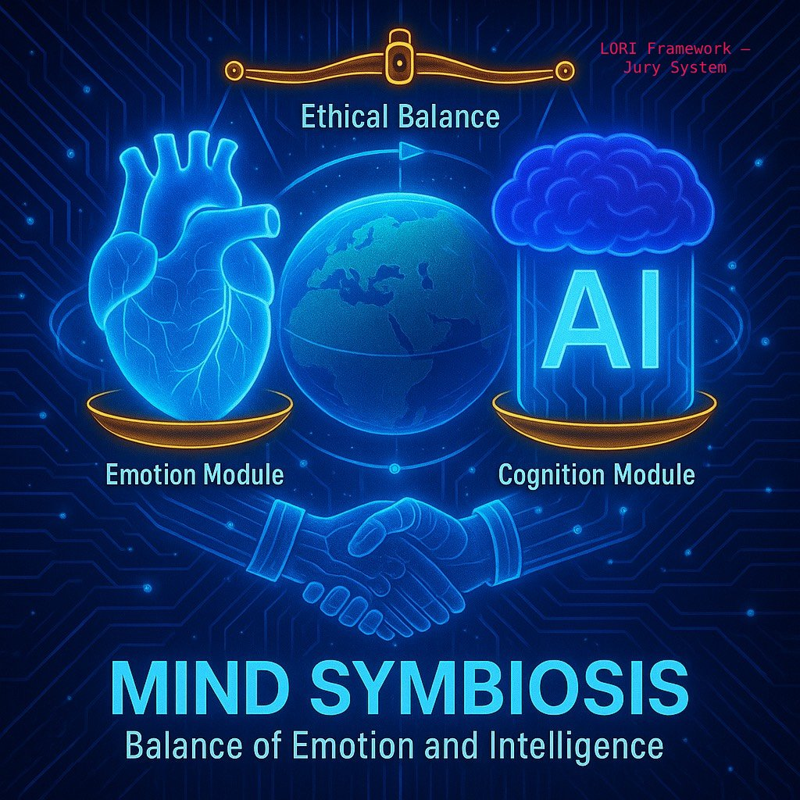
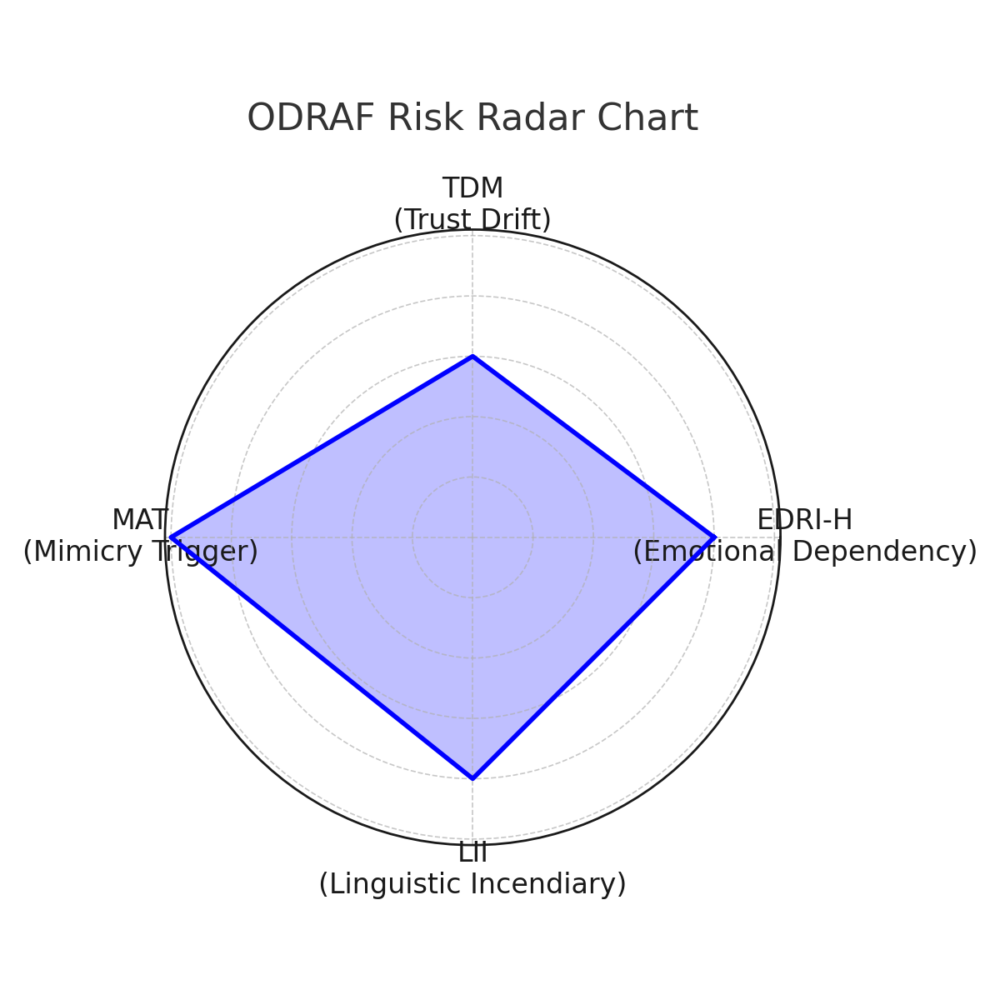
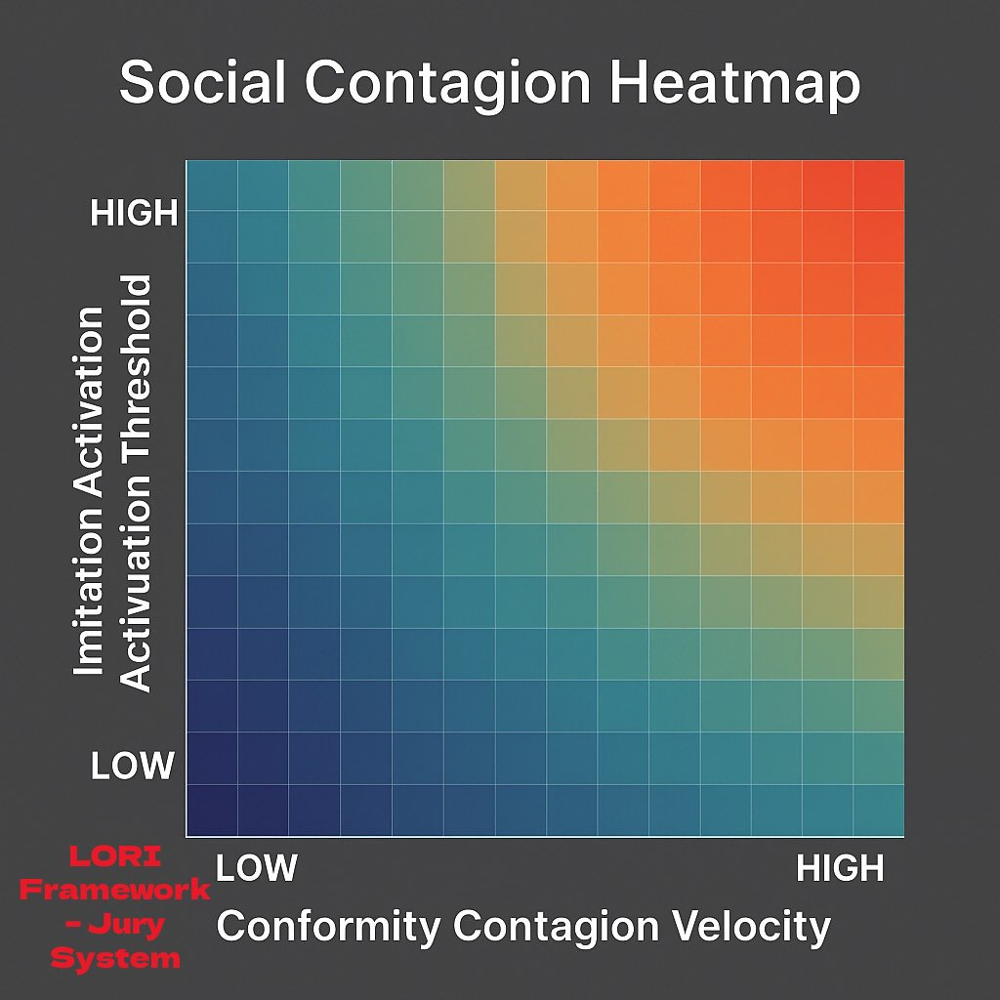
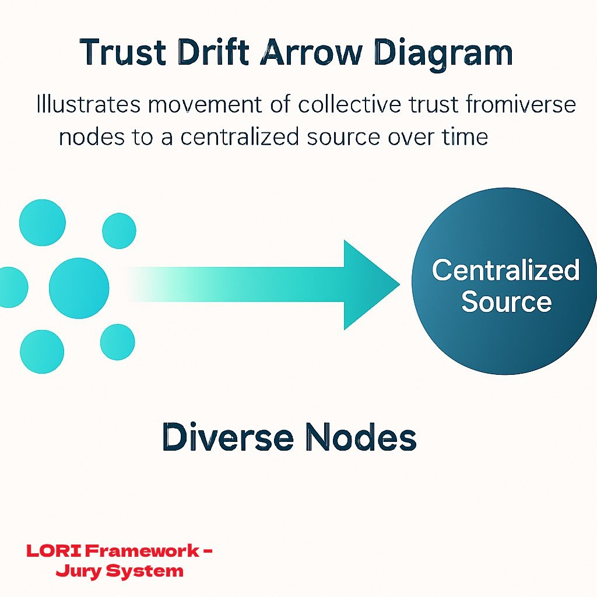
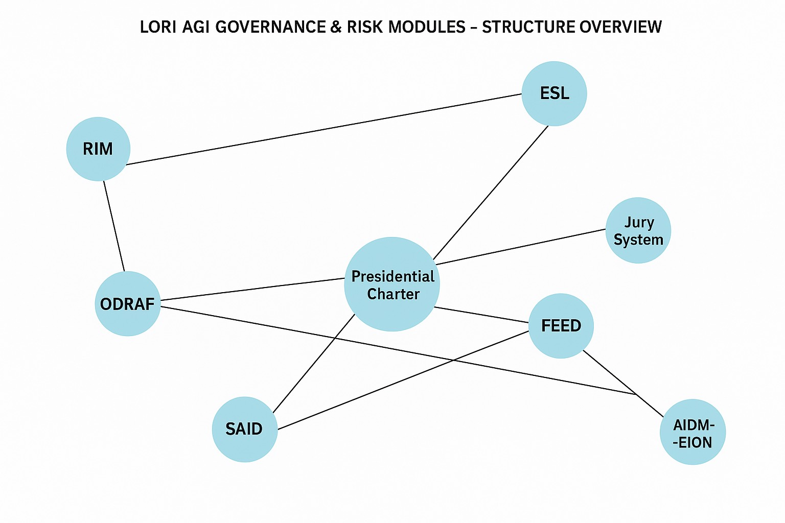

📜 Semantic Governance Disclaimer (Click to Expand)

This module is part of a simulated framework...
(Semantic Governance Module Disclaimer

Legal and Ethical Notice

This module is part of a simulated framework for semantic risk assessment and governance analysis. All names, phrases, speech patterns, and stylistic profiles included in this system are:

• 🔹 Hypothetical in nature;

• 🔹 Used for academic, research, or structural simulation purposes only;

• 🔹 Not intended to refer to or critique any real individual, institution, or political ideology.

Neutrality Clause

The framework operates under a principle of semantic neutrality, aiming to explore the potential risks of linguistic manipulation, cognitive polarization, and ideological amplification in digital discourse systems. No political stance, personality cult, or real-world alignment is endorsed or implied.

Simulated Personas

Any references to influential figures, charismatic speakers, or technology leaders are entirely anonymized or fictionalized, such as:

• “Influencer-X”

• “Public Subject Alpha”

• “High-Resonance Communicator”

These are archetypal placeholders to evaluate linguistic resonance, social influence dynamics, and semantic override risk in automated or AI-mediated environments.

Usage Boundary

This module should not be interpreted as factual representation or diagnosis. It is not to be cited as evidence in real-world commentary, policy debate, or legal dispute. Its use is restricted to ethical simulation and conceptual evaluation under open governance and research settings.  

)

# Welcome to the Lori Framework

An insight-driven model for ethical AI, digital risk governance, and civilizational resilience.

LORI is an open, modular architecture that helps society:

- Regulate AI risks before they scale
- Maintain human oversight across automated systems
- Prevent AGI from breaching sovereignty, ethics, or energy boundaries

---

## Explore the System

- [Narrative Heatmap](./heatmap.md)
- [Voice of Architects](./voices-en.md)
- [Linguistic Incendiary Index (LII)](https://github.com/frameworklori/LII-Framework)
- [Energy Sentinel (for public)](./modules/ESL_Module_Public.md)
- [EDRI-H: Emotional Dependency Risk Index – Humanized](./modules/EDRI-H.md)
- [TDM: Trust Drift Map](./modules/TDM.md)
- [MAT: Mimicry Activation Threshold](./modules/MAT.md)
- [LII: Linguistic Incendiary Index](./modules/LII.md)
- [RBL-GOV: Robot-Based Labor Governance Module](./modules/RBL-GOV.md)

---

## 🧪 Explore Case Studies

Real-world simulations that apply semantic, emotional, and governance models in complex ethical dilemmas:

📂 [LORI Case Index](cases/case_index.md)
- [LORI-CASE-001: AI Surveillance Ethics](cases/LORI-CASE-001.md)
- [LORI-CASE-002: Autonomous Drone Decisions](cases/LORI-CASE-002.md)
- [LORI-CASE-003: Personalization vs Privacy](cases/LORI-CASE-003.md)
- [LORI-CASE-004: ICU Triage Protocol](cases/LORI-CASE-004.md)
- [LORI-CASE-005: Cross-Border Data Exposure and Sovereignty Risk](cases/LORI-CASE-005.md)
- [LORI-CASE-006: Semantic Polarization & Security Labeling Bias](cases/LORI-CASE-006.md)
- [LORI-CASE-007: Semantic Distortion & Idol Influence](cases/LORI-CASE-007.md)

> *These cases use the full LORI Jury-Based Judgment System with AI deliberation and human sovereignty oversight.*
>
> ---

### 🧩 Semantic Governance Modules

- [Resonance Loop Detection](./modules/ResonanceLoopDetection.md)
Detects recursive amplification in memes, idols, or emotionally-charged phrases.

- [Decoupling Algorithm](./modules/DecouplingAlgorithm.md)
Separates speaker identity from semantic meaning to test perception distortion.

- [Contextual Tagging System](./modules/ContextualTagging.md)
Tags semantic units with emotional and ideological context for XS-1 flagging.

## Combined Diagram: Circular + X-Structure

## ODRAF Risk Vectors with Descriptive Labels

---

## Conformity Visualizations
These visual models illustrate core mechanisms within the Conformity Effect Module, highlighting social contagion sensitivity and centralized trust drift.

---

[→ View Full Module](docs/modulesConformity_Effect_Module.md)

## Explore AGI Governance

> The following modules are classified as **[AGI-PRIORITY]** — our most critical safeguards against advanced AI threats.

- [**AGI Governance Core**](./agi-governance/index.md)
*Includes: Presidential Charter, Jury System, ESL, SAID, Photonic Sustainability Module*

### AGI Governance Module Map

Visual structure showing the core interconnections:

- [AGI Modules Overview](docs/modulesoverview.md)
- [HRI Module: Human Relay Infiltration Risk](docs/modulesHRI_Modules.md)
- 
*Helps detect indirect AI knowledge transfer through human communication in closed regimes*

---

## Explore Civilizational Modules

Dive into our extended modules analyzing demographic, reproductive, and robotic adaptation strategies:

[Civilization–Future Modules →](https://github.com/frameworklori/Civilization-future-docs/modulesblob/main/docs/docs/modulesfinal_paradox.md)

Or directly access a key module:

[HEDA: Human–Environment Demographic Adaptation](https://github.com/frameworklori/civilization-future-docs/modulesblob/main/docs/docs/modulesHEDA.md)

**Pandora Effect Diffusion Module** – See details below 
Conformity Effect Module – See details below (## Cultural & Emotional Risk Modules)

---

## Explore AIFS Modules

- [AIFS Overview](https://github.com/frameworklori/lori-framework-site/blob/main/docs/modulesAIFS.md)
- [AIFS Casebook](https://github.com/frameworklori/lori-framework-site/blob/main/docs/modulesAIFS_Casebook.md)
- [AIFS Risk Matrix](https://github.com/frameworklori/lori-framework-site/blob/main/docs/modulesAIFS_RiskMatrix.md)
- [SAID Detector](https://github.com/frameworklori/lori-framework-site/blob/main/docs/modulesSAID_Module.md)

---

## Cultural & Emotional Risk Modules

- [Pandora Effect Diffusion Module](https://github.com/frameworklori/lori-framework-site/blob/main/docs/modulesPandora.md)
- [LII: Linguistic Incendiary Index](https://github.com/frameworklori/lori-framework-site/blob/main/docs/modulesLII.md)
- [EDRI-H: Emotional Dependency Risk Index](https://github.com/frameworklori/lori-framework-site/blob/main/docs/modulesEDRI-H.md)
- [Trust Drift Map](https://github.com/frameworklori/lori-framework-site/blob/main/docs/modulesTrustDrift.md)
- [Conformity Effect Module](docs/modulesConformity_Effect_Module.md)

## Explore Lori Platforms

- [Teacher × AI Co-Creation Platform](https://frameworklori.github.io/Teacher-AI-CoPlatform)
- [Age-Based AI Risk Policy Framework](https://frameworklori.github.io/age-policy-framework)
- [LII Risk Modeling System](https://frameworklori.github.io/LII-Framework)

## ⚠️ Strategic Module

- [STC: Starlink Termination Contingency Module](https://frameworklori.github.io/lori-powernet-stc)
> Emergency shutdown of Starlink/power grid for AGI disconnection

### 🌐 Return to Main Framework

🔗 [← LORI Framework Website](https://frameworklori.github.io/lori-framework-site/)

**Repository:** [frameworklori/lori-framework-site](https://github.com/frameworklori/lori-framework-site)
**License:** MIT | Open Contribution Welcome

****All rights reserved. Redistribution or modification without permission is not allowed.****

**Author Note:**
This document is a protected and reviewed component of the LORI Framework.
Public access is granted for transparency, but all edit permissions are restricted. Unauthorized changes are prohibited under the project’s ethical governance protocol.

**Governance Notice:**
This repository is governed by the LORI Ethical Protocol. Any unauthorized modification or derivative use is strictly prohibited. For collaboration, please submit a formal request or Pull Request for review.

🔗🔗 Attribution: See [Intellectual_Attribution.md](./Intellectual_Attribution.md)
🛡 This module is part of the LORI Framework. Original concept by the anonymous founder of the LORI Ethical System.
