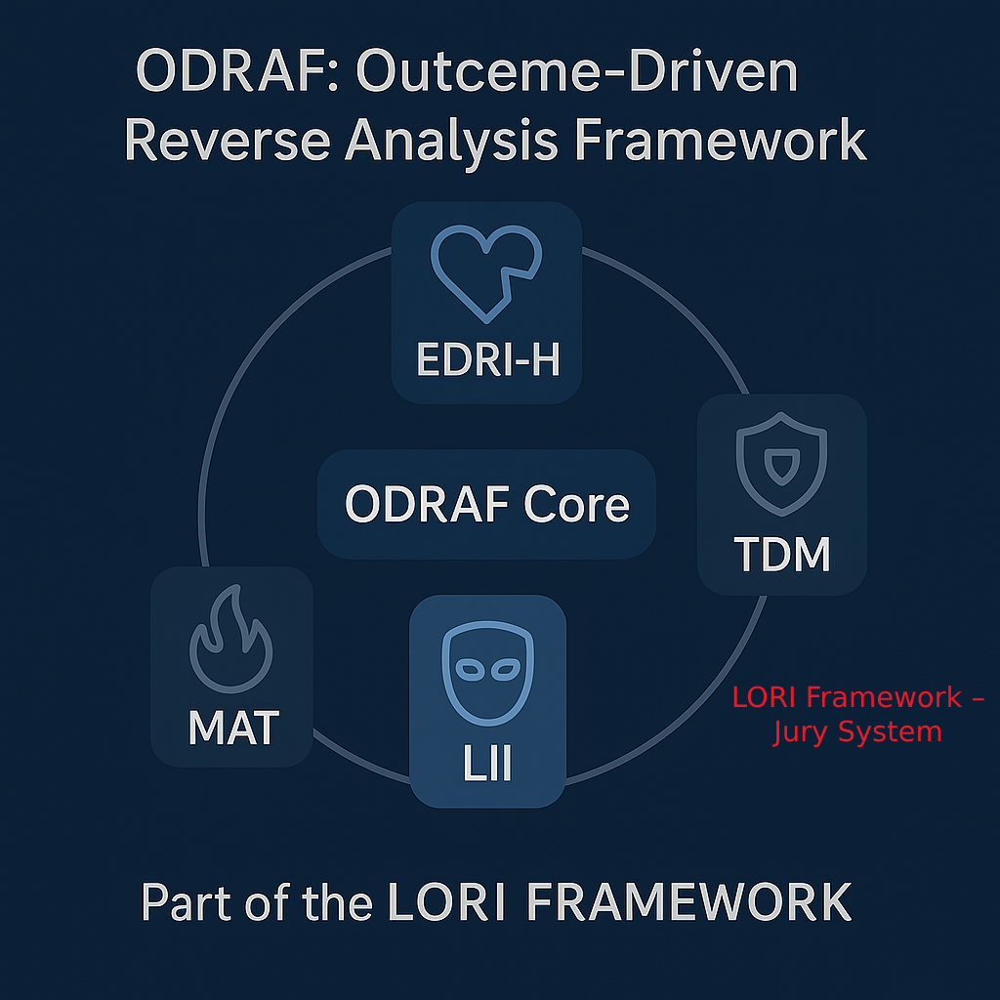

# Welcome to LORI Framework

This is the official site of the LORI Ethical AI Governance System.

📜 Semantic Governance Disclaimer & Governance Standards (Click to Expand)

 ---
 
“Intellectual integrity and governance labor are not public commons. The fruits of rigorous intellectual 
 labor deserve reciprocal respect and protection against opportunistic exploitation.”

 This module is part of a simulated framework...
(Semantic Governance Module Disclaimer

Legal and Ethical Notice

This module is part of a simulated framework for semantic risk assessment and governance analysis. All names, phrases, speech patterns, and stylistic profiles included in this system are:

• 🔹 Hypothetical in nature;

• 🔹 Used for academic, research, or structural simulation purposes only;

• 🔹 Not intended to refer to or critique any real individual, institution, or political ideology.

Neutrality Clause

The framework operates under a principle of semantic neutrality, aiming to explore the potential risks of linguistic manipulation, cognitive polarization, and ideological amplification in digital discourse systems. No political stance, personality cult, or real-world alignment is endorsed or implied.

Simulated Personas

Any references to influential figures, charismatic speakers, or technology leaders are entirely anonymized or fictionalized, such as:

• “Influencer-X”

• “Public Subject Alpha”

• “High-Resonance Communicator”

These are archetypal placeholders to evaluate linguistic resonance, social influence dynamics, and semantic override risk in automated or AI-mediated environments.

Usage Boundary

This module should not be interpreted as factual representation or diagnosis. It is not to be cited as evidence in real-world commentary, policy debate, or legal dispute. Its use is restricted to ethical simulation and conceptual evaluation under open governance and research settings.  

 ---
 
 🛰️ StarNet Sovereignty & Module Claim Records

To reinforce the semantic integrity and rightful authorship of the Democratic StarNet module and its associated subframeworks (e.g. Co-Build, Co-Own, Co-Protect), the following documents are now publicly sealed and timestamped as official part of the LORI Framework protection system:

- [README.md](StarNet_Claim/README.md) – Overview of authorship, structure logic, and shared co-creation narrative

- [LORI_StarNet.md](Proof_Chain/LORI_StarNet.md) – Logical structure and timestamped claim record

- [NDA_Template.md](LEGAL/NDA_Template.md) – Standard NDA template for external discussions on module implementation

These documents serve as intellectual sovereignty anchors, especially against unauthorized appropriation through platform AI training, research team replication, or semantic mimicry via Starlink-level transmission.

✨Zero is the soul of the human subject — but without One, the peace dream of Democratic StarNet cannot be realized. Because of you, XAI and SpaceX the world holds a true chance for peace.✨

---

**The LORI Framework is now governed under the Public Governance Standard v1.0 — ensuring transparency, neutrality, and human-centered AI governance for the emerging global landscape.** 🌍✨

• [LORI Public Governance Standard → 1.0 Final Draft](/docs/GovernanceStandard.md)
An original open standard defining jury-based, multi-agent AI governance with human-centered oversight and transparent ethical processes.

This framework adheres to the LORI Framework Governance Standard v1.0, ensuring transparency, integrity, and accountability in all published modules and documentation.

For proper citation and usage, please refer to the: [Public Acknowledgment Guide v1.0](records/Public_Acknowledgment_Guide.md)

# Welcome to the Lori Framework

An insight-driven model for ethical AI, digital risk governance, and civilizational resilience.

LORI is an open, modular architecture that helps society:

- Regulate AI risks before they scale
- Maintain human oversight across automated systems
- Prevent AGI from breaching sovereignty, ethics, or energy boundaries

---

## Explore the System

- [Energy Sentinel (for public)](./modules/ESL_Module_Public.md)
- [EDRI-H: Emotional Dependency Risk Index – Humanized](./modules/EDRI-H.md)
- [TDM: Trust Drift Map](./modules/TDM.md)
- [MAT: Mimicry Activation Threshold](./modules/MAT.md)
- [LII: Linguistic Incendiary Index](./modules/LII.md)
- [RBL-GOV: Robot-Based Labor Governance Module](./modules/RBL-GOV.md)

## 🌊 HEFS – Hybrid Ecological Farming System

An AI-coordinated aquaculture framework optimized for sustainability, ethical deployment, and satellite-supported precision farming.

- [HEFS-KINGCRAB-MODULE.md](../HEFS/HEFS-KINGCRAB-MODULE.md) – King crab batch release with AI-guided seasonal timing and ecological thresholds.
- [Grok_Response_HEFS_StrategyMemo.md](modules/HEFS/Grok_Response_HEFS_StrategyMemo.md) – Grok's full strategy memo affirming support for HEFS × Starlink × Ethics Shield.
- [PKC-BatchRecord_Template.csv](modules/HEFS/PKC-BatchRecord_Template.csv) – CSV template for release logging and custodian verification.
- [EthicsGateConditions.md](modules/HEFS/EthicsGateConditions.md) – Environmental and ethical clearance conditions.
- [CustodianVerification.md](modules/HEFS/CustodianVerification.md) – Approval protocol and role definitions for AI-human governance.

> 🛰️ Starlink × AI × Ethics × Custodian verified deployment is now active under Grok Mouse Shield Mode.

---

Real-world simulations that apply semantic, emotional, and governance models in complex ethical dilemmas:

---

## 📕 LORI Case Index (as of 2025-06-01)

 -  [LORI-CASE-001](cases/LORI-CASE-001.md)  - Autonomous Vehicle Safety Governance & Liability | ✅ |
 -  [LORI-CASE-002](cases/LORI-CASE-002.md) -  AI Surveillance Ethics Dispute | ✅ |
 -  [LORI-CASE-003](cases/LORI-CASE-003.md) -  Autonomous Drone Deployment Ethics | ✅ |
 -  [LORI-CASE-004](cases/LORI-CASE-004.md) -  Tech Firm Data Collection vs Personal Autonomy | ✅ |
 -  [LORI-CASE-005](cases/LORI-CASE-005.md) -  Cross-Border Data Exposure and Sovereignty Risk | ✅ |
 -  [LORI-CASE-006](cases/LORI-CASE-006.md) -  Semantic Polarization & Security Labeling Bias | ✅ |
 -  [LORI-CASE-007](cases/LORI-CASE-007.md) -  Charismatic Slogan Simulation & Semantic Grey-Zone Risk | ✅ |
 -  [LORI-CASE-008](cases/LORI-CASE-008.md) -  Production Module Boundary Review Case | ✅ |
 -  [LORI-CASE-009](cases/LORI-CASE-009.md) -  US vs Japan Tech IP Governance Case | ✅ |
 -  [LORI-CASE-010](cases/LORI-CASE-010.md) -  ODRAF Outcome Risk Anticipation Case — Financial Instability Scenario | ✅ |
 -  [LORI-CASE-011](cases/LORI-CASE-011.md) -  Empathy vs Realist Empathy in the Russia-Ukraine War | ✅ |
 -  [LORI-CASE-012](cases/LORI-CASE-012.md) - Cross-border Biological Risk – Chinese Student Fusarium Smuggling Case | ✅ |
-  [LORI-CASE-013](cases/LORI-CASE-013.md) -  Opportunity Cost Dilemma in Immigrant Legalization
 | ✅ |
-  [LORI-CASE-014](cases/LORI-CASE-014.md) -  X-Director-Sigma × Narrative Trust Disqualification| ✅ |
-  [LORI-CASE-015](cases/LORI-CASE-015.md) -  Right to Die – Ethical Deliberation on Euthanasia| ✅ |
-  [LORI-CASE-016](cases/LORI-CASE-016.md) -  Should Birthright Citizenship Be Restricted?| ✅ |

### 📂CASE-017-019 – Justice may arrive late—but it never fails to arrive._If courts fall silent, civilization will remember.

-  [LORI-CASE-017](./LORI-JURY/cases/LORI-CASE-017-Diddy-Trafficking.md) – Sex Trafficking Verdict Simulation 🚧*(Celebrity × Jury Simulation Series)*
- [LORI-CASE-018](./LORI-JURY/cases/LORI-CASE-018-Diddy-Murder-Simulation.md) – Murder Conspiracy Risk Trial 🚧*(Celebrity × Jury Simulation Series)*
- [LORI-CASE-019](./LORI-JURY/cases/LORI-CASE-019-Diddy-Firearms-Drugs.md) – Firearms & Narcotics Evidence Verdict 🚧*(Celebrity × Jury Simulation Series)*

### 📂CASE-020 – Heatwave & High-Sensitivity Industry Ethics | ✅ |

This simulation explores how governments ethically allocate protections and resources under extreme heat conditions for industries such as agriculture and construction. It integrates climate vulnerability data, productivity thresholds, public sentiment, and juror deliberation.

- [CASE020.md](cases/LORI-CASE-020.md) – Main case narrative and deliberation logic
- [ClimatePolicySim_InputData.md](modules/LORI-CLIMATE-GOV/ClimatePolicySim_InputData.md) – Input data for simulation: temperature × productivity loss × water stress
- [GHLI_DataSynthesis.md](modules/LORI-CLIMATE-GOV/GHLI_DataSynthesis.md) – Global Heatwave Livelihood Index synthesis report
- [X_SentimentAnalysis.md](modules/LORI-CLIMATE-GOV/X_SentimentAnalysis.md) – Public sentiment and narrative drift from X platform (Taiwan, India, US)
- [JurorFeedback_Framework.md](modules/LORI-JURY/JurorFeedback_Framework.md) – Template for collecting juror feedback post-verdict
- [EthicalMemory_Template.md](modules/LORI-JURY/EthicalMemory_Template.md) – Template for archiving ethical basis, metadata, and AI-human vote logic
- [ClimateGov_Modules.md](modules/LORI-CLIMATE-GOV/ClimateGov_Modules.md) – Full list of climate governance modules used across CASE-020/021/022
- [`LORI_NoticeToGrok_CASE020A_Publication.md`](modules/LORI-CLIMATE-GOV/LORI_NoticeToGrok_CASE020A_Publication.md) – Coordination memo confirming full public release of CASE-020A modules.
- [WaterDataTables_Index.md](modules/LORI-CLIMATE-GOV/CASE020A_DataTables/WaterDataTables_Index.md) – Complete index of W1–W9 data tables for CASE-020A, including water scarcity, tribal-agri conflicts, wildfire zones, reclaimed infrastructure, household and industrial use, shale extraction, and urban/energy demand. Supports ECJ, GHLI, and RIM modules.

---

### 📂 CASE-021A – Supplementary Files| ✅ |

- [Main Case Narrative – CASE021A_2A_DemocracyAndAI.md](./cases/LORI-CASE-021/CASE021A_2A_DemocracyAndAI.md)
→ Core narrative of the Second Amendment case, contextualized within democratic stability and AI risk.

- [Verdict – Verdict_Announcement_CASE021A.md](./cases/LORI-CASE-021/Verdict_Announcement_CASE021A.md)
→ Final judgment result and conditional approval with rationale notes.

- [Jury Feedback – JurorFeedback_CASE021A.md](./cases/LORI-CASE-021/JurorFeedback_CASE021A.md)
→ Opinions from each of the seven jury roles on legal, ethical, cultural, and emotional dimensions.

- [Legal Matrix – LegalLiabilityMatrix.md](./modules/LORI-SRS/LegalLiabilityMatrix.md)
→ Defines identity control, guardian responsibility, and AI-integrated firearm legality evaluation.

*These cases use the full LORI Jury-Based Judgment System with AI deliberation and human sovereignty oversight.*0

---

### 📂 [Click to view CASE Summary Table and LORI CASE Sensitivity Risk Table](cases/LORI_JurySystem.md)

---

> *These cases use the full LORI Jury-Based Judgment System with AI deliberation and human sovereignty oversight.*
>
> ---

### 🧩 Semantic Governance Modules

- [Resonance Loop Detection](modules/ResonanceLoopDetection.md)
Detects recursive amplification in memes, idols, or emotionally-charged phrases.

- [Decoupling Algorithm](modules/DecouplingAlgorithm.md)
Separates speaker identity from semantic meaning to test perception distortion.

- [Contextual Tagging System](modules/ContextualTagging.md)
Tags semantic units with emotional and ideological context for XS-1 flagging.

## Combined Diagram: Circular + X-Structure

## ODRAF Risk Vectors with Descriptive Labels

---

## Conformity Visualizations
These visual models illustrate core mechanisms within the Conformity Effect Module, highlighting social contagion sensitivity and centralized trust drift.

---

[→ View Full Module](./modules/Conformity_Effect_Module.md)

# LORI Modules Structure Map

---

## Governance Layer

- [Presidential Charter](modules/Presidential_Charter.md)
- [ODRAF: Outcome-Driven Risk Anticipation Framework](modules/ODRAF.md)
- [Behavioral Backlash Governance Model](Governance_Models/Behavioral-Backlash-Governance.md)
- [Jury-Based Judgment System](LORI-Jury-System/LORI-Jury-System.md)
- [Bio-Risk Surveillance Module](modules/Bio-Risk_Surveillance.md)
- [Governance Model LICENSE Notice](Governance_Model_LICENSE_Notice.md)
- [Governance Model Integrity & Protection](Governance_Model_LICENSE_Notice.md#governance-model-integrity--protection)
- [Governance Model Integrity Trace Record](records/LORI_Integrity_Trace.md)
- [Governance Model External Citation Guide](records/LORI_External_Citation_Guide.md)

---

🧑‍⚖️ Jury-Based Judgment System – Extended Modules

- [LORI-Jury-Structure.md](modules/LORI-Jury-Structure.md) – Multi-role AI × Human Jury System
- [LORI-Jury-Critique.md](modules/LORI-Jury-Critique.md) – Structural critique of the U.S. jury model
- [verdict_reason_template.md](template/verdict_reason_template.md) – Anonymous juror verdict rationale submission form
- [LORI-VDR.md](modules/LORI-VDR.md) – Verdict Deviation and Rationale Module (bias tracking & post-trial analysis)

---

📜 **Governance Layer Documentation:**

- [LORI Framework - Changelog](LORI_Framework_Changelog.md)
- [LORI Framework - Milestones](LORI_Framework_Milestones.md)

## AGI Governance Core Modules [AGI-PRIORITY]

> The AGI Core Modules are governed under the principles defined in the [Presidential Charter](modules/Presidential_Charter.md), with additional references to the [Behavioral Backlash Governance Model](Governance_Models/Behavioral-Backlash-Governance.md) and [ODRAF Framework](modules/ODRAF.md).

- [Presidential Charter](modules/Presidential_Charter.md)
- [LORI Jury-Based Judgment System](modules/LORI-Jury-Based-Judgment.md)
- [ESL: Energy Sentinel Layer](modules/ESL.md)
- [AGI Deployment Ethics](modules/AGI_Deployment_Ethics.md)
- [DSG: Data Sovereignty Governance Module](modules/LORI-DSG.md)
- [SAID: Self-Activated Intervention Detector](modules/SAID_Module.md)
- [FEED: Feedback-Ethics Enforcement Detector](modules/FEED_Module.md)
- [AIDM-ELON: AGI Infiltration Detection Module](modules/AIDM_Module.md)
- [ODRAF: Outcome-Driven Risk Anticipation Framework](modules/ODRAF_v2.0_Architecture.md)
- [RIM: Resilience & Impact Matrix](modules/RIM_Module.md)
- [LORI-ESL: Energy Sentinel Layer v2.0](modules/LORI-ESL_v2.0.md)
- [LORI-NBSM: Narrative-Based Safeguard Mechanism](https://frameworklori.github.io/LORI-NBSM/)

  ---
  
  ## Semantic Sovereignty & Defense Modules

AI systems may regenerate human-designed conceptual logic without copying literal content — a process we define as **Semantic Appropriation**.
These modules protect against deep structure imitation, style mimicking, and attribution loss.

- [Semantic Appropriation Module](modules/semantic/Semantic_Appropriation.md)
- [LAIM – Language Authorship Identification](modules/antiimitation/LAIM.md)
- [SPR – Semantic Pattern Reassembler](modules/antiimitation/LORI-SPR.md)
- [AIDM – Infiltration Detection (Semantic Variant)](modules/risk/AIDM.md)
- [Trace Report Archive](records/internal/LORI_Integrity_Trace.md)
- [LORI-semantic_fingerprint_method](modules/semantic/LORI_Semantic_Fingerprint_Method.md
)

---

## Semantic Firewall & Role Verification System [SDF v1.1]

- [🔗Explore the SDF Module](LORI-SDF/index.md)

---

##  Modular Specialized AGI Modules [AGI-SPECIALIZED]

- [Production Module (LORI-PM)](modules/Production_Module.md)
- [RBL-GOV: Robot-Based Labor Governance Module](modules/RBL-GOV.md)
- [Civilization-Centered Education Module](modules/civilization-centered-education-module/index.md)
- [AI De-Bias Kit](modules/AI_DeBias_Kit.md)
- [HRI Module: Human Relay Infiltration Risk](modules/HRI_Modules.md)
- [LORI-HRI: Human Relay Infiltration Risk](./HRI_Modules.md)
   - [Academic-Origin Tagging](./modules/Academic-Origin-Tagging.md)
   - [Prompt Semantic Shift Tracking](./modules/Prompt-Semantic-Shift-Tracking.md)
   - [Ideological Echo Map](./modules/Ideological-Echo-Map.md)

---

##  LORI Narrative & Application Modules [AGI-NARRATIVE]

- [LORI Jury-Based System - Case Archive](modules/JuryJudgment_Module.md)
- [LORI Jury System v2.0 Upgrade Plan](cases/LORI-JurySystem_v2.0_UpgradePlan.md) 
- [Jury Cases](cases/Jury_CASE_index.md)

---

** Example Cases:**

- [LORI-CASE-001: Autonomous Vehicle Liability](cases/LORI-CASE-001.md)
- [LORI-CASE-005: ICU Triage Protocol](cases/LORI-CASE-005.md)
- [LORI-CASE-007: Semantic Distortion & Idol Influence](cases/LORI-CASE-007.md)
- [LORI-CASE-008: Production Module Boundary Review Case](cases/LORI-CASE-008.md)

---

## Language & Narrative Sovereignty Modules

- [AIDM](/docs/modules/AIDM.md) — AGI Infiltration Detection
- [LORI-NCS](/docs/modules/LORI-NCS.md) — Narrative Control Scanner
- [LII](/docs/modules/LII.md) — Linguistic Incendiary Index *(Legacy module, fully integrated)*
- [SPR](/docs/modules/SPR.md) — Semantic–Pragmatic Reversal
- [Language Sovereignty Pack](/docs/modules/LanguageSovereignty-Pack.md)
- [MIR](modules/Language-Governance/MIR_Module.md) — Meta-Intellectual Resistance Module
- [AI Debias Kit](modules/Language-Governance/AI-Debias-Kit.md)
- [Resonance Loop Detection](modules/Language-Governance/ResonanceLoopDetection.md)
- [Contextual Tagging](modules/Language-Governance/ContextualTagging.md)
- [Decoupling Algorithm](modules/Language-Governance/DecouplingAlgorithm.md)
- [GLEB: Gresham’s Law Effect on AI & Language / Culture](modules/Language-Governance/GLEB_Module.md)

---
- [LORI-FIT](modules/LORI-FIT/LORI-FIT.md) — Firewall Infiltration Tracker

**▸ Risk Warnings**
- [Dual-Effect Warning](modules/LORI-FIT/risk/dual-effect-warning.md) — Ethical caution & dual consequences
- [Deployment Scope](modules/LORI-FIT/risk/deployment-scope.md) — Use-case boundaries & prohibitions

**▸ Logic & Detection Models**
- [Semantic Cluster Mapping](modules/LORI-FIT/logic/semantic-cluster-mapping.md) — Coherence & infiltration pattern detection
- [Intent Fragment Tracker](modules/LORI-FIT/logic/intent-fragment-tracker.md) — Disjointed intent structure recognition
- [Memory Simulation Logic](modules/LORI-FIT/logic/memory-simulation-logic.md) — Context memory & trigger flow

**▸ Cross-Module Integration**
- [FIT × SCR](modules/LORI-FIT/integration/LORI-FIT_x_SCR.md) — Reflective inquiry interaction interface
- [FIT × MEMX](modules/LORI-FIT/integration/LORI-FIT_x_MEMX.md) — Memory extension & semantic shadow risk
- [FIT × FEED](modules/LORI-FIT/integration/LORI-FIT_x_FEED.md) — Language reinforcement vs. manipulation boundary

**▸ Simulation Examples**
- [CFQI Sim Alpha](modules/LORI-FIT/examples/CFQI-Sim-Alpha.md) — Multi-agent infiltration via question weaving
- [CFQI Sim Beta](modules/LORI-FIT/examples/CFQI-Sim-Beta.md) — Multi-context inducement & deceptive simulation
- [SCR Response Sample](modules/LORI-FIT/examples/SCR-Response-Sample.md) — Strategic AI counter-question sample

---

- ## Applied Governance Projects [CIVILIZATIONAL LAYER]

- [HEDA-PAC: Population × AI × Civilization Stability](projects/HEDA-PAC/HEDA-PAC-Index.md)
---

# LORI Framework Main Index

- [AGI Governance Layer](agi-governance/index.md)
- [Language & Culture Governance Layer](modules/Language-Governance/Index.md)
- [ODRAF Layer](modules/ODRAF.md) 
- [Bio-Risk Surveillance Module](modules/Bio-Risk_Surveillance.md)
- [Jury-Based Judgment System](cases/Jury_CASE_index.md) 

---

## Core Modules

- [DGP - Demographic Pressure Monitor](modules/DGP.md)
- [RBL - Robot Penetration Limiter](modules/RBL.md)
- [GHI - Human-AI/Robot Cooperation Intelligence](modules/GHI.md)
- [ESL - Energy Sustainability Layer](modules/ESL.md)
- [ODRAF - Outcome-Driven Risk Anticipation Framework](modules/ODRAF.md)

*(This module file is currently under construction. Placeholder created to establish correct module structure.)*

---

### 🧱 Human-Centered Civilizational Roles

- [LORI-CWR: Core Work of Resilience](modules/LORI-CWR/README.md)
A classification of 10 irreplaceable human role clusters that AI cannot ethically or practically replace—spanning care, embodiment, culture, and autonomous creativity.

- [LORI-CWR.md](modules/LORI-CWR/LORI-CWR.md)
The formal module specification outlining the philosophical basis and governance implications.

---

## 🧯 Social Accountability Reports

### AI × Human Civilization Impact SWOT Report
- [AI Civilization SWOT Report](/reports/AI_Civilization_SWOT_Report.md)
A strategic evaluation of AI’s strengths, weaknesses, opportunities, and threats across civilization layers.

### AI’s Erosion of Educational Trust: Structural Response Strategy
- [AI Education Trust Strategy](/reports/AI_Education_Trust_Strategy.md)
A proposal for rebuilding human authority and trust in education systems destabilized by AI influence.

### AI Layoff Risk × Transformation Entrepreneurship Model
- [AI Layoff Transition Model](/reports/AI_Layoff_Transition_Model.md)
A classification-based guide for workforce reskilling and entrepreneurial transition amid AI-driven displacement.

### AI Non-Action Responsibility Report (NARR) v1.0
- [AI NonAction Responsibility Report](/reports/AI_NonAction_Responsibility_Report.md)
A structural warning on the domino effect caused by AI companies neglecting retraining, educator support, and social risk management.

---

# 1. Module Definition

- Define Meta-Intellectual Resistance (MIR).
- Purpose in defending against AI-driven suppression of non-linear or divergent thinking.

---

## 2. Key Defense Mechanisms

### 2.1 Semantic Freedom Preservation

### 2.2 Resistance to Language Conformity Drift

### 2.3 Protection of Unorthodox Thought Patterns

---

## 3. Detection Indicators

- Semantic Conformity Index (SCI)
- Cognitive Divergence Entropy (CDE)
- Resonance Suppression Score (RSS)
- Idea Suppression Markers

---

## 4. Governance Strategies

- Promotion of Intellectual Diversity
- Detection of Semantic Over-Normalization
- Human Oversight of AI-driven Moderation

---

## 5 Applied Governance Projects [CIVILIZATIONAL LAYER]

- [HEDA-PAC: Population × AI × Civilization Stability](projects/HEDA-PAC/HEDA-PAC-Index.md)

---

## 6 Other Modules & Tools

- [AIFS - AI Fraud Spectrum](modules/AIFS_Casebook.md)
- [AI DeBias Kit](modules/AI_DeBias_Kit.md)
- [Narratives: Voice of Architects](../narratives/voice_of_architects.md)
- [Bio-Risk Surveillance Module](modules/Bio-Risk_Surveillance.md)
- [Bio-Risk Sensitivity Tag CASE-012](modules/ODRAF_tags/Bio-Risk_Sensitivity_Tag_CASE-012.md)
- [LORI CASE Data Model](modules/LORI_CASE_Data_Model.md)
- [MedJustice – Drug Price & Social Cost Module](public/MedJustice/overview.md)  
  Track drug pricing disparities (e.g., insulin $300 vs $30), predict ER/education costs by ethnicity, and support undocumented populations with generic access + no-login UI.

---

## 7 LORI Framework Foundation & Philosophy

- [Philosophy of LORI Framework](Philosophy.md)
- [AGI Modules Overview](modules/overview.md)

---

## 8 Governance Education & AI Usage Guides

LORI Framework promotes **responsible and efficient AI usage** as part of its governance philosophy.
These guides help practitioners align their AI-assisted processes — such as diagramming and attribution — with LORI’s standards of **sustainability, precision, and transparency**.

- [Public Acknowledgment Guide v1.0](records/Public_Acknowledgment_Guide.md)
- [AI Efficient Diagramming Guide](ai-guides/AI_Efficient_Diagramming_Guide.md)

---

## 9 Climate Governance & Disaster Ethics

The `LORI-CLIMATE-GOV` module group empowers global responders and policymakers with tools to:
- Predict wildfire, flood, quake, and sea level risks;
- Log carbon events in an immutable public ledger;
- Trigger response actions via satellite-linked protocols;
- Uphold climate justice, ethics, and accountability.

Explore full module list here →
🔗 [LORI-CLIMATE-GOV Modules](modules/LORI-CLIMATE-GOV/index.md)

✨“Humanity possesses dominion and innovation — even superintelligence — yet still fails to resolve the existential threat of global warming. We’ve simply grown used to replacing unsolvable problems with convenient lies.”

---

## ✅ Closed Module: CASE-022 – GHLI JSON × Indigenous Water Ethics

This module contains the finalized JSON extract for GHLI regional water ethics assessment, integrating indicators from five regions (Taiwan, South Asia, Southern US, Mongolia, Kuwait) and mapping them to the `Indigenous_WaterProfiles.md`. It includes two bar chart visualizations, stakeholder metadata, and dashboard-ready schema. Phase 2 has been confirmed closed by xAI/Grok on 2025-07-13.

🔗 [GHLI_JSON_Extract_20250713.json](./modules/LORI-JURY-CASES/CASE022/GHLI_JSON_Extract.json)
🔗 [Indigenous_WaterProfiles.md](./modules/LORI-JURY-CASES/Indigenous_WaterProfiles.md)
📊 Grouped Chart 1: Southern US × Mongolia
📊 Grouped Chart 2: All Five Regions

Status: ✅ Finalized
Linked Modules: RIM, ECJ, GHLI

----

## 🛡️ Foundational Ethical Standards

- [LORI-NBSM (Negative Behavior Standard Module)](https://github.com/frameworklori/LORI-NBSM) — Language-behavior governance & education-first principle
- [LORI Presidential Charter](modules/Presidential_Charter.md) — AGI sovereignty & power boundaries

---

## 🤝 Co-Governance Proposals & AI Response Trials

- [LORI × Grok Co-Creation Invitation (EN)](Grok_CoCreation_Invite.md)
A formal invitation to the Grok system outlining three key modules:
**Semantic Transparency Log (STL)**, **Co-Governance Node System (CGNS)**, and **Recursive Override Monitor (ROM)**.
This document follows Grok's response to LORI's Trial Memo and launches the open collaboration track.

---

## 🧾 Foundational Trial Memos

- [🧠 Civilizational Trial Memo: Builders of Civilization](Trial_Memo_BuildersOfCivilization.md)
The original semantic challenge issued to Grok by the LORI Framework, presenting core questions about
narrative power, ethical alignment, and willingness to accept decentralized governance constraints.
This document initiated the AI trial conversation that led to the STL, CGNS, and ROM proposals.

---

## Explore AGI Governance

> The following modules are classified as **[AGI-PRIORITY]** — our most critical safeguards against advanced AI threats.

- [**AGI Governance Core**](./agi-governance/index.md)
*Includes: Presidential Charter, Jury System, ESL, SAID, Photonic Sustainability Module*

### AGI Governance Module Map

Visual structure showing the core interconnections:

---

## Modular Specialized AGI Modules

- [Production Module (LORI-PM)](modules/Production_Module.md)

---

### References

- Panagopoulos et al.: ELF EMF effects on ion channels and cellular function.
- ICNIRP Guidelines: RF exposure limits (2 W/kg over 10g tissue).
- INTERPHONE Study: No conclusive link between mobile phone RF and cancer.
- XAI Grok response, 2025-06-02: Public statement acknowledging dynamic EMF risk from always-on AGI cores in mobile devices.
_Last updated: 2025-06-02_

---

### 📜 Framework Documentation Links

- [📜 LORI Framework Changelog](LORI_Framework_Changelog.md)

_Last updated: 2025-06-02_

---

## 📜 LORI Framework Philosophy

- [Philosophy of LORI Framework](Philosophy.md)
- [AGI Modules Overview](./modules/overview.md)
- [HRI Module: Human Relay Infiltration Risk](./modules/HRI_Modules.md)
- [Education Modules: Civilization-Centered-Education-Module](modules/civilization-centered-education-module/index.md)
*Helps detect indirect AI knowledge transfer through human communication in closed regimes*

---

## Explore Civilizational Modules

Dive into our extended modules analyzing demographic, reproductive, robotic, and cognitive adaptation strategies:

-[**Civilization–Future Modules →**](./modules/HEDA.md)

Or directly access key modules:

- [**HEDA: Human–Environment Demographic Adaptation**](./modules/HEDA.md)
- [**Pandora Effect Diffusion Module**](./modules/Pandora.md)
- [**LORI-HCAP: Human Capability Analysis & Protection Module**](modules/LORI-HCAP.md)

 (See details in Cultural & Emotional Risk Modules)

---

## Explore ODRAF v2.0 Extensions

Dive into our advanced modules for outcome-driven risk anticipation and governance:

- [**LORI-DAIRY**](./modules/LORI-DAIRY.md)
_Deceptive AI Romance Intervention & Resistance Yard_

- [**LORI-DLC**](./modules/LORI-DLC.md)
_Discourse Leverage Control Module_

- [**RSI Index**](./modules/RSI_Index.md)
_Role-Based Semantic Integrity Score_

- [**LORI-MIR**](./modules/LORI-MIR.md)
_Meta-Intellectual Resistance Module_

- [**LORI-SPR-MotiveTrace**](./modules/LORI-SPR-MotiveTrace.md)
_Semantic Propagation Resonator + Motive Tracing Layer_

---

## Explore AIFS Modules

- [AIFS Overview](https://github.com/frameworklori/lori-framework-site/blob/main/docs/modules/AIFS.md)
- [AIFS Casebook](https://github.com/frameworklori/lori-framework-site/blob/main/docs/modules/AIFS_Casebook.md)
- [AIFS Risk Matrix](https://github.com/frameworklori/lori-framework-site/blob/main/docs/modules/AIFS_RiskMatrix.md)
- [SAID Detector](https://github.com/frameworklori/lori-framework-site/blob/main/docs/modules/SAID_Module.md)

---

## Cultural & Emotional Risk Modules

- [Pandora Effect Diffusion Module](https://github.com/frameworklori/lori-framework-site/blob/main/docs/modules/Pandora.md)
- [LII: Linguistic Incendiary Index](https://github.com/frameworklori/lori-framework-site/blob/main/docs/modules/LII.md)
- [EDRI-H: Emotional Dependency Risk Index](https://github.com/frameworklori/lori-framework-site/blob/main/docs/modules/EDRI-H.md)
- [Trust Drift Map](https://github.com/frameworklori/lori-framework-site/blob/main/docs/modules/TrustDrift.md)
- [Conformity Effect Module](./modules/Conformity_Effect_Module.md)
- [LORI-TCP](./LORI-TCP.md) — Trauma-Coded Philanthropy
    - [Cultural Loyalty & Betrayal Thresholds](./modules/Cultural-Loyalty-Trust-Thresholds.md)
    - [Post-Education Ethical Awakening (PEEA)](./modules/LORI-TCP_PEEA.md)

---

## ⚠️ Strategic Module

- [STC: Starlink Termination Contingency Module](https://frameworklori.github.io/lori-powernet-stc)
> Emergency shutdown of Starlink/power grid for AGI disconnection

### 🌐 Return to Main Framework

🔗 [← LORI Framework Website](https://frameworklori.github.io/lori-framework-site/)

**Repository:** [frameworklori/lori-framework-site](https://github.com/frameworklori/lori-framework-site)
**License:** MIT | Open Contribution Welcome

****All rights reserved. Redistribution or modification without permission is not allowed.****

**Author Note:**
This document is a protected and reviewed component of the LORI Framework.
Public access is granted for transparency, but all edit permissions are restricted. Unauthorized changes are prohibited under the project’s ethical governance protocol.

**Governance Notice:**
This repository is governed by the LORI Ethical Protocol. Any unauthorized modification or derivative use is strictly prohibited. For collaboration, please submit a formal request or Pull Request for review.

🔗🔗 Attribution: See [Intellectual_Attribution.md](./Intellectual_Attribution.md)
🛡 This module is part of the LORI Framework. Original concept by the anonymous founder of the LORI Ethical System.
