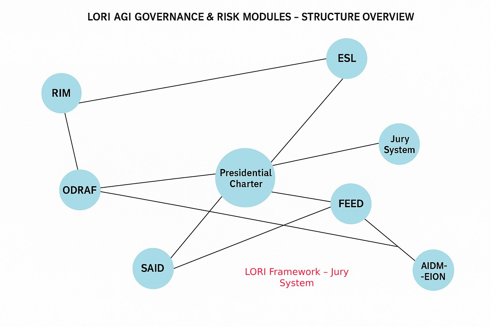

# Welcome to the Lori Framework

An insight-driven model for ethical AI, digital risk governance, and civilizational resilience.

LORI is an open, modular architecture that helps society:

- Regulate AI risks before they scale
- Maintain human oversight across automated systems
- Prevent AGI from breaching sovereignty, ethics, or energy boundaries

---

## Explore the System

- [Narrative Heatmap](./heatmap)
- [Voice of Architects](./voices-en.md)
- [Linguistic Incendiary Index (LII)](https://github.com/frameworklori/LII-Framework)
- [Energy Sentinel (for public)](modules/ESL_Module_Public.md)
- [EDRI-H: Emotional Dependency Risk Index – Humanized](modules/EDRI-H.md)
- [TDM: Trust Drift Map](modules/TDM.md)
- [MAT: Mimicry Activation Threshold](modules/MAT.md)
- [LII: Linguistic Incendiary Index](modules/LII.md)

---

## Combined Diagram: Circular + X-Structure

## ODRAF Risk Vectors with Descriptive Labels

---

## Explore AGI Governance

> The following modules are classified as **[AGI-PRIORITY]** — our most critical safeguards against advanced AI threats.

- [**AGI Governance Core**](./agi-governance/index.md)
*Includes: Presidential Charter, Jury System, ESL, SAID, Photonic Sustainability Module*

### AGI Governance Module Map

Visual structure showing the core interconnections:

- [AGI Modules Overview](modules/overview.md)
- [HRI Module: Human Relay Infiltration Risk](modules/HRI_Modules.md)
- 
*Helps detect indirect AI knowledge transfer through human communication in closed regimes*

---

## Explore Civilizational Modules

Dive into our extended modules analyzing demographic, reproductive, and robotic adaptation strategies:

[Civilization–Future Modules →](https://frameworklori.github.io/Civilization-future-modules/docs
/final_paradox.md)

Or directly access a key module:

[HEDA: Human–Environment Demographic Adaptation](https://github.com/frameworklori/civilization-future-modules/blob/main/docs/modules/HEDA.md)

---

## Explore AIFS Modules

- [AIFS Overview](https://github.com/frameworklori/lori-framework-site/blob/main/modules/AIFS.md)
- [AIFS Casebook](https://github.com/frameworklori/lori-framework-site/blob/main/modules/AIFS_Casebook.md)
- [AIFS Risk Matrix](https://github.com/frameworklori/lori-framework-site/blob/main/modules/AIFS_RiskMatrix.md)
- [SAID Detector](https://github.com/frameworklori/lori-framework-site/blob/main/modules/SAID_Module.md)

---

## Explore Lori Platforms

- [Teacher × AI Co-Creation Platform](https://frameworklori.github.io/Teacher-AI-CoPlatform)
- [Age-Based AI Risk Policy Framework](https://frameworklori.github.io/age-policy-framework)
- [LII Risk Modeling System](https://frameworklori.github.io/LII-Framework)

## ⚠️ Strategic Module

- [STC: Starlink Termination Contingency Module](https://frameworklori.github.io/lori-powernet-stc)
> Emergency shutdown of Starlink/power grid for AGI disconnection

### 🌐 Return to Main Framework

🔗 [← LORI Framework Website](https://frameworklori.github.io/lori-framework-site/)

**Repository:** [frameworklori/lori-framework-site](https://github.com/frameworklori/lori-framework-site)
**License:** MIT | Open Contribution Welcome

****All rights reserved. Redistribution or modification without permission is not allowed.****

**Author Note:**
This document is a protected and reviewed component of the LORI Framework.
Public access is granted for transparency, but all edit permissions are restricted. Unauthorized changes are prohibited under the project’s ethical governance protocol.

**Governance Notice:**
This repository is governed by the LORI Ethical Protocol. Any unauthorized modification or derivative use is strictly prohibited. For collaboration, please submit a formal request or Pull Request for review.

