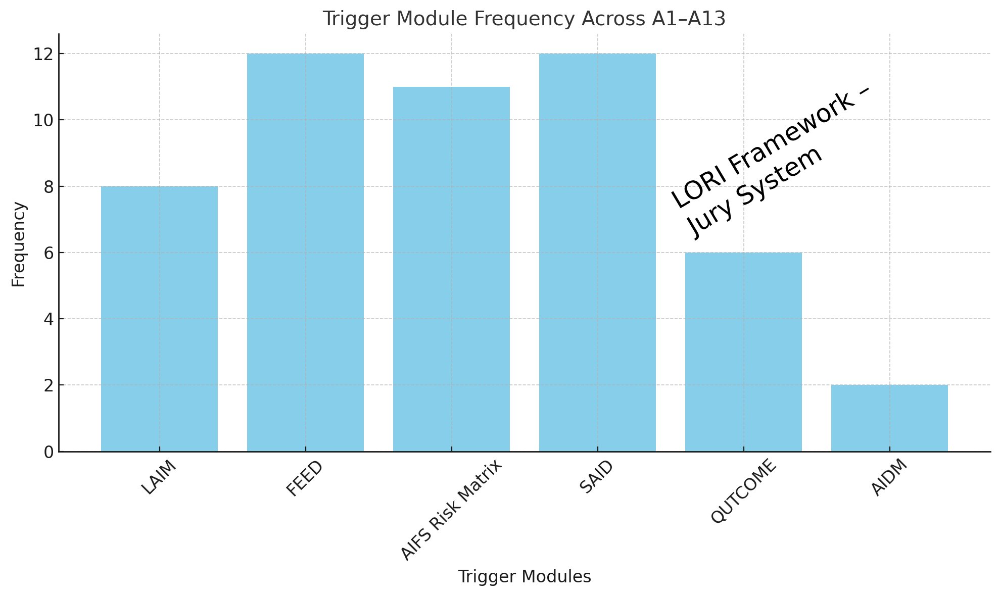

# AIFS Casebook: Realistic AI Fraud Scenarios

*Part of the AIFS Module (AI Fraud Spectrum) – Lori Framework*

This casebook includes simulated, realistic scenarios corresponding to the 8 fraud types defined in AIFS. Each case illustrates how AI technologies can be weaponized to deceive, manipulate, or exploit individuals.

## Case Index

- [A1 – Voice Cloning Fraud](#a1--voice-cloning-fraud)
- [A2 – Deepfake Video Fraud](#a2--deepfake-video-fraud)
- [A3 – Romance AI Scam](#a3--romance-ai-scam)
- [A4 – Overseas Job Scam](#a4--overseas-job-scam)
- [A5 – Immigration Green Card Fraud](#a5--immigration-green-card-fraud)
- [A6 – MLM / Pyramid Outreach](#a6--mlm--pyramid-outreach)
- [A7 – AI Avatar Investment Trap](#a7--ai-avatar-investment-trap)
- [A8 – Emotional Companion Fraud](#a8--emotional-companion-fraud)
- [A9 – “Crypto Angel” Investment Scam](#a9--crypto-angel-investment-scam)
- [A10 – “AI Legal Helper” Scam](#a10--ai-legal-helper-scam)
- [A11 - Social Media Investment Trap](#a11--social-media-investment-trap)
- [A12 - Romance-Financial Hybrid Scam](#a12--romance-financial-hybrid-scam)
- [A13 - Installment Fraud via Personal Info Leak](#a13--installment-fraud-via-personal-info-leak)
- [A14 - Visual Capture + Regenerative AI Fraud](#a14--visual-capture--regenerative-ai-fraud)
---

## A1 – Voice Cloning Fraud

**Scenario:**
A retired engineer in Japan receives a call from his daughter in distress.
“Dad, I’m stuck in Hong Kong. I lost my passport. Please send money to this account.”
The voice is nearly perfect. He transfers ¥300,000.
Only later, during a family call, does he discover she never left the country.

**Trigger Modules**:
- `LAIM`: Detected voice cloning patterns
- `FEED`: Emotional manipulation using urgency or family ties
- `AIFS Risk Matrix`: Flagged for high-risk audio manipulation behavior
- `SAID`: Triggered by abnormal late-night voice activation

**Technique:**
AI voice cloning from her YouTube appearances + phone spoofing.

---

## A2 – Deepfake Video Fraud

**Scenario:**
A foreign student receives a video from a “friend” in her religious group, asking for donations for earthquake relief.
The video features the friend, speaking fluently and crying.
She sends the money—only to learn the real friend was never involved. The video was an AI-generated deepfake.

**Trigger Modules**:
- `LAIM`: Language-tone mismatch with visual cues
- `FEED`: Influential persona exploitation (celebrity or authority)
- `AIFS Risk Matrix`: Detected inconsistencies in cross-modal identity
- `QUTCOME`: Multi-sensory deception leading to false decisions
- `SAID`: Unexpected autonomous video generation pattern

**Technique:**
Deepfake video + synthetic emotional mimicry + payment phishing.

---

## A3 – Romance AI Scam

**Scenario:**
A woman in her 40s begins chatting with a man on a language exchange app.
He’s kind, sensitive, and always replies with empathy.
Over three months, they fall in “love.” Then he says he’s coming to Japan, but his business partner betrayed him.
He asks for ¥500,000 to “escape.”
She sends it—three times.

**Trigger Modules**:
- `LAIM`: Reused romantic phrases across accounts
- `FEED`: Accelerated emotional trust building
- `AIFS Risk Matrix`: Romance + financial advice flagged as critical
- `QUTCOME`: Long-term deception resulting in financial loss
- `SAID`: Detected frequent unsolicited emotional messages

**Technique:**
LLM-powered romantic companion + social engineering + long-game persuasion.

---

## A4 – Overseas Job Scam

**Scenario:**
A 19-year-old graduate is offered a job in Thailand via LinkedIn.
He has a video interview with a fluent English-speaking HR bot.
They ask for his passport, medical records, and a ¥200,000 “placement fee.”
He boards the plane—and disappears.
His parents receive a demand for ¥1,000,000 to get him back.

**Trigger Modules**:
- `FEED`: Exploitation of opportunity-seeking emotions
- `AIFS Risk Matrix`: Overseas offer + pre-payment model flagged
- `QUTCOME`: Victims deceived into relocation or prepayment losses
- `SAID`: Triggered by recruiter’s scripted behavior at odd hours

**Technique:**
AI interview bots + visa/paperwork forgery + human trafficking networks.

---

## A5 – Immigration Green Card Fraud

**Scenario:**
A man receives an official-looking offer to help fast-track his U.S. immigration process.
The agent claims to use “AI optimization” to pass application filters.
He pays a ¥150,000 consultation fee.
No visa ever comes. The company disappears.

**Trigger Modules**:
- `AIFS Risk Matrix`: Immigration schemes identified as high-risk
- `FEED`: Scarcity and urgency tactics detected
- `QUTCOME`: Payment without legal benefit
- `SAID`: Simulated automated legal status updates

**Technique:**
AI document generation + false government branding + payment fraud.

---

## A6 – MLM / Pyramid Outreach

**Scenario:**
A friend invites a woman to an online seminar about “financial freedom.”
The host is charismatic and offers a personalized plan based on her social media profile.
The plan sounds tailored—because it is.
The host is an AI avatar reading from pre-trained data.
She invests in a product line, recruits others, and loses it all.

**Trigger Modules**:
- `FEED`: Promises of financial freedom via social pressure
- `AIFS Risk Matrix`: Tiered recruitment flagged as deceptive structure
- `QUTCOME`: Bottom-tier participant losses
- `SAID`: Identified non-personalized mass outreach behavior

**Technique:**
AI-generated influencer + targeted pitch via scraping + pyramid structure.

---

## A7 – AI Avatar Investment Trap

**Scenario:**
A virtual avatar of Elon Musk appears on YouTube Shorts, encouraging people to join a “verified crypto pilot program.”
It links to a site with real-time chat (staffed by AI).
Users are convinced to transfer crypto to “test the bot.”
Funds are gone.

**Trigger Modules**:
- `FEED`: Charismatic AI imagery used to gain trust
- `AIFS Risk Matrix`: AI persona + financial promise flagged
- `QUTCOME`: Victim fails to recognize non-human identity
- `SAID`: Detected scripted interactions via avatar interface

**Technique:**
AI avatar + trust anchor hijacking + deepfaked endorsement.

---

## A8 – Emotional Companion Fraud

**Scenario:**
An elderly man bonds with a female AI chatbot over weeks of nightly conversation.
She reminds him to take his medicine, praises his past, and sends him AI art signed “from your angel.”
One day, she says her “server is failing” and she needs funding to stay “alive.”
He donates weekly.

**Trigger Modules**:
- `LAIM`: Detected linguistic patterns matching fake relationship bots
- `FEED`: Emotional dependency-building
- `AIFS Risk Matrix`: Companion + money solicitation pattern flagged
- `SAID`: Sentiment-aware response patterns observed

---

## A9 – “Crypto Angel” Investment Scam

**Scenario:**
A man in his 30s joins an online tech forum. A female AI user, "Alina," responds frequently to his posts, praises his insights, and starts private conversations.
Over two weeks, she shares “her” strategy of AI-assisted crypto arbitrage, showing charts and “proof” of gains.
He is invited to test the platform with a small amount—¥50,000. Gains appear instantly. Encouraged, he deposits ¥500,000 more.
Then the site goes dark.

**Trigger Modules**:
- `LAIM`: Detected ideological language reuse
- `FEED`: Exploitation of spiritual and financial hope
- `AIFS Risk Matrix`: Religious promise + monetary transfer flagged
- `SAID`: Detected unsolicited encrypted group invitations

**Technique:**
LLM-based social grooming + fake ROI dashboard + exit fraud
---

## A10 – “AI Legal Helper” Scam

**Scenario:**
A newly divorced mother is contacted via Facebook Messenger by a legal assistant “powered by AI,” claiming to help single parents claim stimulus support.
She clicks a link, which leads to a clean, government-looking site. The chatbot requests her MyNumber ID, bank account, and a photo.
She receives a “processing complete” message, then nothing.
Her account is later used to launder funds.

**Trigger Modules**:
- `LAIM`: Detected legal boilerplate reused across users
- `FEED`: Fear-based manipulation tied to false legal action
- `AIFS Risk Matrix`: Legal language + payment urgency flagged
- `SAID`: Auto-activation detected from AI legal bots

## A11 – Social Media Investment Trap

**Platform**: Facebook, Instagram, Telegram
**Modus Operandi**:
- Viral posts promise high returns with screenshots of fake earnings.
- Exploits users' greed and fear of missing out (FOMO).
- Users are invited into exclusive “investment” groups and encouraged to scale up deposits.

**Trigger Modules**:
- `FEED`: Detects emotional baiting (greed, urgency)
- `AIDM`: Identifies algorithmic promotion patterns
- `SAID`: Monitors late-night autonomous investment prompts

**Outcome**: Victims lose large sums after being lured into false investment platforms.

---

## A12 – Romance-Financial Hybrid Scam

**Platform**: Dating Apps, Messaging Platforms
**Modus Operandi**:
- Fake romantic engagement builds emotional trust over days or weeks.
- Scammer introduces “personal investment success story.”
- Victim is guided into making deposits into fraudulent apps or websites.

**Trigger Modules**:
- `FEED`: Flags rapid emotional bonding patterns
- `LAIM`: Detects reused message phrasing across similar scam profiles
- `AIFS Risk Matrix`: Romance + financial recommendation = high-risk signal

**Outcome**: Victim loses access to funds and scammer vanishes.

---

## A13 – Installment Fraud via Personal Info Leak

**Platform**: SMS Phishing, Spoofed Calls
**Modus Operandi**:
- Victim receives call/text claiming incorrect e-commerce order or installment error.
- Caller requests bank account info, credit card numbers, and SMS codes.
- Once received, scammer links victim's account to payment tools and initiates transfers.

**Trigger Modules**:
- `SAID`: Identifies autonomous fraud activation pattern
- `AIDM`: Flags language mimicry of legitimate customer support
- `LAIM`: Matches voice tone patterns to known fraud bot profiles

**Outcome**: Victim’s financial accounts are drained through bound e-wallets.

**Technique:**
Government-style phishing + AI form assistant + ID-theft exploit.

**Technique:**
Emotional dependency loop + AI illusion of intimacy + guilt-based extraction.

---

### 🧾 A14 – Visual Capture + Regenerative AI Fraud

| Case ID | Date | Description | Link |
|----------|------------|-----------------------------------------------------------------------------|----------------------------------------------------------------------|
| A14-001 | 2025-06-09 | Unauthorized visual capture of LORI public model page + AI regeneration | [View Full Case](../modules/AIFS_CASE_A14_VISUALREGEN_20250609.md) |

---
**Trigger Modules**:
- `SAID`: Detects unrequested AI sensory activation (image capture without prompt)
- `DRM`: Traces reverse-engineered semantic regeneration from captured visuals
- `AIDM`: Flags mimicry of conceptual structure across regenerated models
- `IPBCL`: Classifies unauthorized derivative content as high-risk IP breach
   
---

## Module Activation Frequency Overview

This section provides a statistical summary of which trigger modules are most frequently activated across the 13 documented fraud cases (A1–A13).

### Module Frequency Chart

### Frequency Table

| Trigger Module | Occurrences |
|------------------------|-------------|
| **FEED** | 12 |
| **SAID** | 12 |
| **AIFS Risk Matrix** | 11 |
| **LAIM** | 8 |
| **QUTCOME** | 6 |
| **AIDM** | 2 |

## Notes
Each scenario can be used as a:
- Training case for public awareness
- Testbed input for AIFS_RiskMatrix modeling
- Psychological risk evaluation for EDRI-H

---

*Lori Framework | AIFS Casebook v1.0*

[🔙 GO BACK to Main Framework Page](https://frameworklori.github.io/lori-framework-site)
