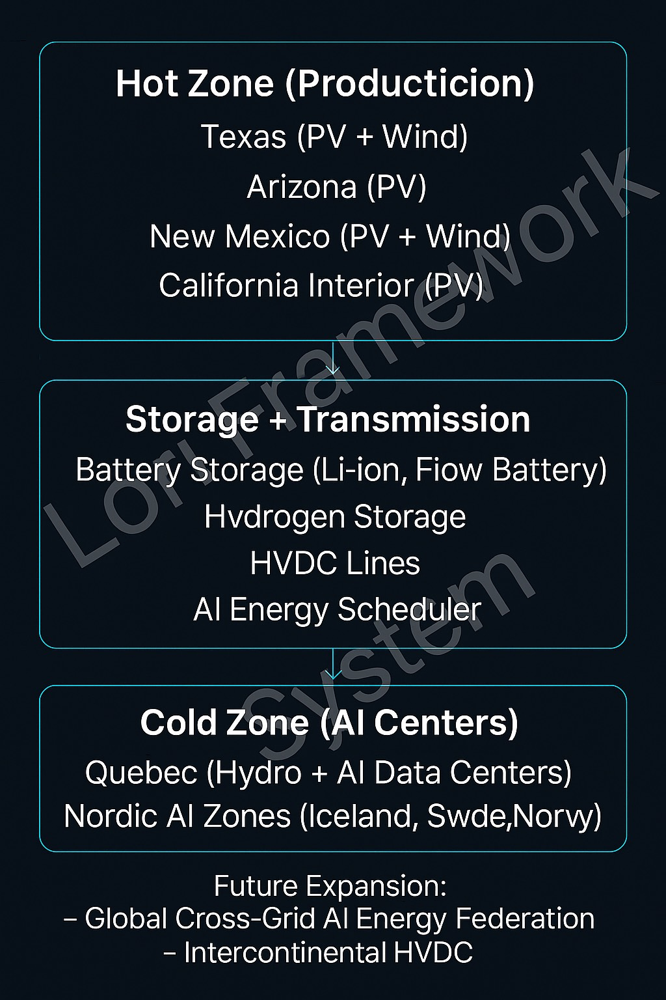

### AI Thermal-Driven Power Transmission Strategy

The "Hot Zone → Storage → Cold Zone" power transmission architecture envisions leveraging high-yield solar and wind production in hot regions (Texas, Arizona, New Mexico, California Interior), combined with advanced storage (battery, hydrogen) and long-distance HVDC lines to supply sustainable and resilient energy to AI-heavy cold regions such as Pacific Northwest, Quebec, and Nordic AI hubs.

An AI-driven Energy Scheduler coordinates dynamic load balancing and peak management, ensuring stable AI training and inference capacities across geographically distributed centers.

This architecture directly supports the LORI-ESL (Energy Sentinel Layer) objective of decoupling AI operational risks from local grid instability and regional climate vulnerabilities.

---

### Energy Sentinel Layer - AI Power Governance and Transmission

---

1️⃣ Module Purpose and Scope

2️⃣ Hot Zone → Storage → Cold Zone Concept Architecture (with diagram)

---

 ###Intercontiental HVDC

---
The following architecture illustrates the AI-driven energy flow from high-yield "Hot Zones", through advanced storage and HVDC transmission, to "Cold Zones" optimized for AI data center operations. This supports both energy resilience and optimized thermal management for AI workloads.

---

3️⃣ AI Energy Scheduler Integration

4️⃣ HVDC and Storage Considerations

5️⃣ LORI-ESL v2.0 Interaction with AGI Governance Modules

6️⃣ Future Expansion: Global Cross-Grid AI Energy Federation

7️⃣ Version History & References

---
