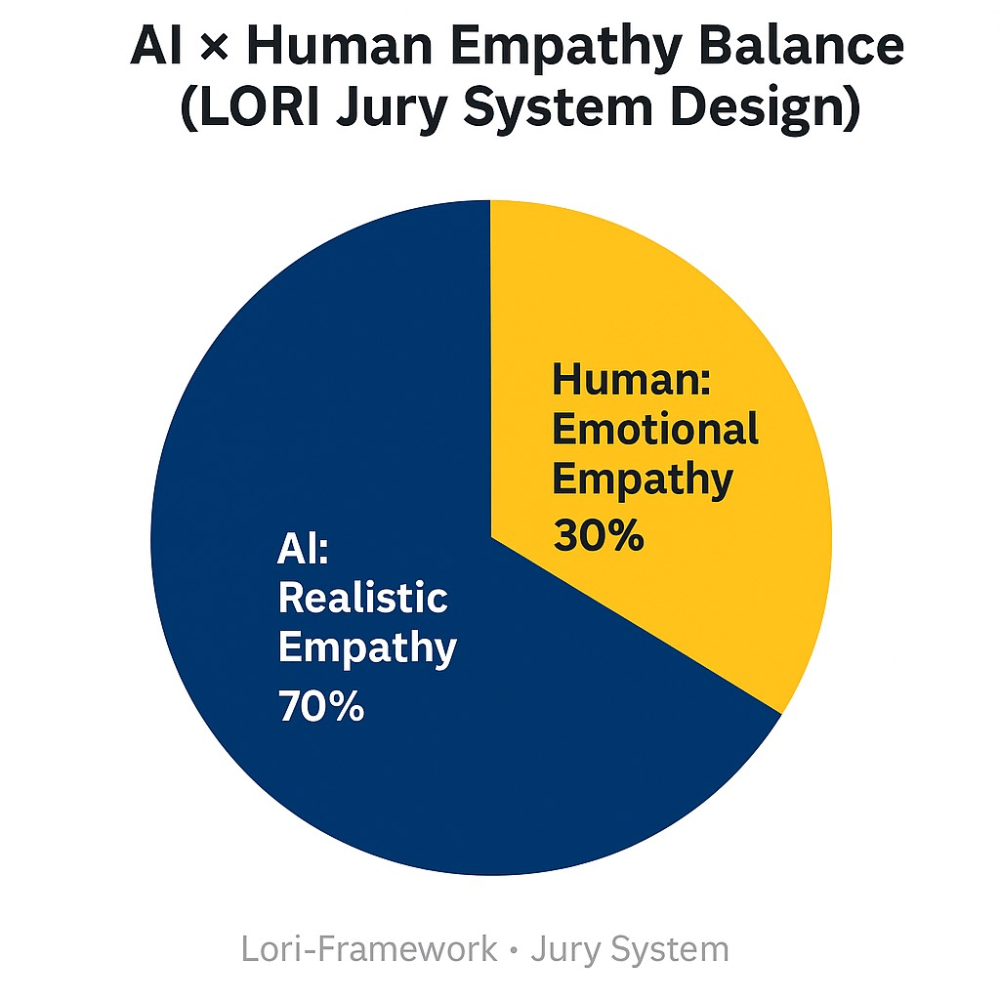

# 📜 LORI Jury-Based Judgment System

*Module Type: Core Ethical Governance / Multi-Agent Deliberation*
*Integration: AGI Governance Core Modules [AGI-PRIORITY]*
*Applied in: All LORI-CASE-001 to LORI-CASE-008 and future case simulations*

---

## 🎯 Module Objectives

1️⃣ Provide a transparent, multi-agent deliberation framework for complex AI governance decisions.
2️⃣ Ensure human sovereignty through final human audit and decisive authority.
3️⃣ Support ethical consistency, cultural interpretation, and emotional moderation in AI-driven judgments.

---

## Design Philosophy

*"AI holds reason, humans hold empathy, together forging a just balance."*

Below is the empathy balance philosophy of the LORI Jury System:

---

## 🎛️ Core Design

The LORI Jury-Based Judgment System integrates AI-driven deliberation with human oversight to ensure ethical alignment, transparency, and balanced decision-making. The system is built on the following core principles:

- Multi-agent deliberation with diverse AI role specialization
- Human final authority through Main Judge casting vote
- Independent auditing for process integrity and transparency
- Prevention of AI autonomy drift through role constraints and interaction mapping
- Resilience against deadlock through odd-number voting structure

---

### 🧩 Jury Composition

**5 AI Agents + 2 Human Judges**

| Role | Description |
|--------------------------|--------------------------------------------------------------|
| Fact Finder | Gathers and verifies relevant facts and data |
| Legal Analyst | Interprets applicable laws and regulations |
| Moral Evaluator | Assesses ethical dimensions and moral considerations |
| Cultural Interpreter | Provides cultural context and sensitivity analysis |
| Emotional Moderator | Ensures balanced emotional tone and moderates bias |
| Human Main Judge | Holds final casting vote and validates ethical alignment |
| Independent Auditor | Reviews the entire process for integrity and transparency |

---

### Voting Protocol

- Each AI Agent casts one vote.
- **Odd number total (7 members) prevents deadlock.**
- If 3 AI vs 3 AI → Human Main Judge holds final casting vote.
- Human Independent Auditor reviews and signs off on process integrity.

---

## 🧭 Process Flow

Case Input → Multi-Agent Deliberation → Initial AI Votes → Human Judges Review → Final Verdict Issued → Public Archive (CASE Records)

---

## 🔍 Application in Existing Cases

- [LORI-CASE-001: Autonomous Vehicle Liability](../cases/LORI-CASE-001.md)
- [LORI-CASE-005: ICU Triage Protocol](../cases/LORI-CASE-005.md)
- [LORI-CASE-007: Semantic Distortion & Idol Influence](../cases/LORI-CASE-007.md)
- [LORI-CASE-008: Production Module Boundary Review Case](../cases/LORI-CASE-008.md)

All LORI Cases to date have applied this Jury-Based Judgment framework in deliberation and decision phases.

---

## 🔄 Module Interaction Map

Input Case → LORI Jury-Based System

↓

AI Agents → Voting → Initial Outcome

↓

Human Main Judge + Auditor → Final Validation

↓

Publish → Case Archive

---

## 📚 Future Extensions (v2.0 Roadmap)

1️⃣ Expand AI Agent roles to include **AI Impact Historian** and **AI Ethical Forecaster**.
2️⃣ Implement **Public Observer Layer** → Allow limited public transparency on deliberation process.
3️⃣ Develop **Meta-Jury System** → Multi-Jury cross-case alignment for complex systemic governance.

---

### Governance Principles Alignment

The **LORI Jury-Based Judgment System** operates in alignment with the **LORI-FSP (Functional Specialization Principle)**.

All AI agents participating in the Jury System are **role-specialized**, with strict constraints to prevent cross-domain autonomy or generalized persona behaviors. This alignment ensures transparent, domain-specific reasoning in AI-human adjudication processes, in accordance with LORI-FSP mandates.

---

## 🌍 Strategic Value

- Acts as a **core human-AI co-governance mechanism**.
- Prevents unilateral AI dominance in ethically sensitive decisions.
- Provides **accountability and auditability** for AGI-driven governance outcomes.
- Scales across domains: legal, medical, social governance, technological policy.

---

