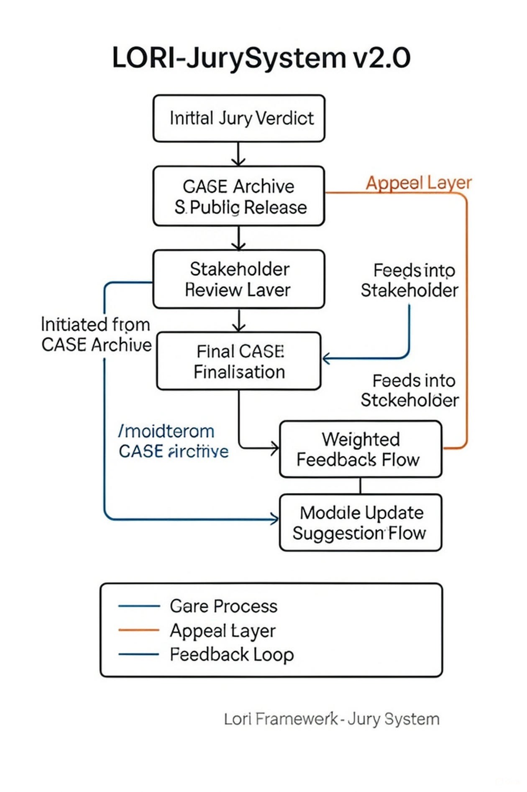

LORI-Jury-Structure.md 

# ⚖️ LORI-Jury-Structure.md – Ethical AI Jury Architecture

**Part of the LORI Framework — Interpretable Judgment & Deliberative Justice System**

> This document defines the structural logic and role-based architecture of the LORI Jury-Based Judgment System.
> Designed to replace the fragile 12-person human jury with a transparent, modular, and ethically grounded hybrid system.

---

## 🧩 1. Overview

The LORI Jury System is built on a **5 AI + 2 Human** multi-role architecture to ensure:

- Bias-resistant deliberation
- Ethical transparency
- Role-specific expertise
- Human sovereignty override

---

## 👥 2. Jury Composition (7 Total Members)

| Role | Type | Core Function |
|-----------------------|-----------|-------------------------------------------------------|
| 🧾 Fact Finder | AI Agent | Gathers and verifies factual claims |
| 🧑‍⚖️ Legal Analyst | AI Agent | Applies law, precedent, and statutory frameworks |
| 🎭 Moral Evaluator | AI Agent | Integrates ethical reasoning across outcomes |
| 🧬 Cultural Interpreter | AI Agent | Detects bias, coercion, and cultural nuance |
| 💠 Emotional Moderator | AI Agent | Controls emotional influence, stabilizes tone |
| 👤 Sovereignty Judge | Human | Final override vote in 3:3 deadlocks |
| 👁️ Independent Auditor | Human | Verifies system integrity, exposes manipulations |

---

## 🔁 3. Deliberation Flow

[Evidence Input] → Fact Finder → Legal Analyst → Moral Evaluator → Cultural Interpreter → Emotional Moderator

↓                          ↓                         ↓                          ↓

[Weighted Verdict Matrix] ←—←—←—←—←—←—←—←—←—←—←—←—←—←—←—←

→ If 4:1 or 5:0 AI consensus → Verdict passed
→ If 3:2 AI split → Sovereignty Judge votes
→ If Audit anomaly triggered → Auditor intervenes (pause/rollback)

---

## 🗳️ 4. Voting Logic

- **Default Threshold:** Majority (≥4 AI agents agree)
- **Deadlock Handling:**
- 3:3 tie → Human Sovereignty Judge casts deciding vote
- If Human abstains → Verdict “inconclusive” (return for retrial or arbitration)

---

## 🧠 5. Role Definitions

### 🧾 Fact Finder
- Filters emotional evidence
- Validates claims from multiple sources
- Assigns credibility scores

### 🧑‍⚖️ Legal Analyst
- Applies multi-jurisdictional logic
- Weighs burden of proof and liability
- Flags misused legal strategy

### 🎭 Moral Evaluator
- Considers societal good, harm, dignity
- Compares equity vs utilitarian outcomes
- Highlights moral blind spots

### 🧬 Cultural Interpreter
- Identifies cultural distortion or narrative weaponization
- Detects coercion masked as consent
- Aligns decisions across ethical frames

### 💠 Emotional Moderator
- Neutralizes emotional hijack tactics
- Scores sentiment bias in arguments
- Balances affective influence

### 👤 Sovereignty Judge (Human)
- Decides in split scenarios
- Justifies override based on human-centric logic
- Records rationale in [Anonymous Verdict Form](template/verdict_reason_template.md)

### 👁️ Independent Auditor (Human)
- Detects AI manipulation or hacking
- Reviews deviation logs and verdict biases
- Initiates case suspension if needed

---

## 📐 6. Diagram Reference

> See `/docs/assets/images/JurySystem_v2.0_Structure.png` for architecture visualization.

---

## 🔎 7. Judgment Traceability

All 7 jurors submit anonymized rationale forms after final vote:

- Stored via `LORI-VDR.md` (Verdict Deviation Recorder)
- Enables semantic alignment analysis
- Detects anomalous verdict logic or cultural imbalance

---

## 🌐 8. Related Modules

- [LORI-Jury-Critique.md](./LORI-Jury-Critique.md)
- [verdict_reason_template.md](../templates/verdict_reason_template.md)
- [LORI-VDR.md](./LORI-VDR.md) *(upcoming)*
- [LORI-LII.md](./LORI-LII.md)
- [LORI-FIT.md](./LORI-FIT.md)
- [LORI-AIDM.md](./LORI-AIDM.md)

---

## ✅ Conclusion

The LORI Jury System replaces randomness and emotional overload with:
- Role clarity
- Ethical balance
- Human sovereignty
- AI interpretability

It is not designed to *simulate fairness* — but to *structure it*.

