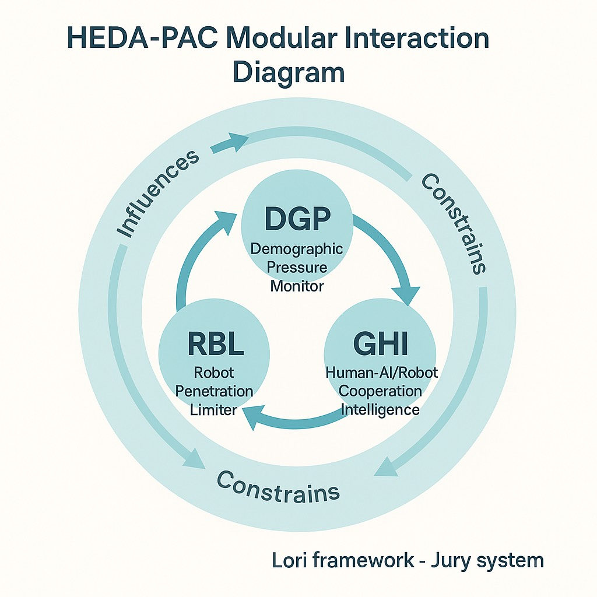

# HEDA-PAC-CASE-003
**US Robotics & Service Labor Replacement**

---

## Scenario

The United States is undergoing a rapid wave of **AI-driven automation**, particularly in service sectors such as retail, hospitality, logistics, healthcare, and customer service.
While the US does not face an immediate population collapse, **sector-specific labor shortages** and **profit-driven AI-first business models** are accelerating the replacement of human workers with AI and robotics.

This automation disproportionately affects **jobs traditionally held by vulnerable populations**, including low-skilled workers, minority communities, and recent immigrants.
As a result, **poverty rates are rising** in affected communities, and **income inequality is widening**.
Public concerns about **dehumanization**, **loss of community cohesion**, and **social polarization** are growing.

At the same time, **AI and robotics technologies**—while transformative—cannot fully replace human value in all domains.
Robots exhibit inherent limitations in **physical adaptability**, **real-time situational judgment**, and **fine-grained human interaction**.
For example, robots struggle with tasks requiring rapid response to unexpected events, or operations sensitive to time and environmental conditions (e.g., delivering ice cream before it melts).

Moreover, **education remains the most powerful lever** for enabling human workers to adapt to an AI-augmented economy.
Through targeted **AI-assisted education and skill development**, vulnerable populations can be empowered to move into roles where **human strengths—creativity, empathy, adaptability, and contextual judgment—remain irreplaceable**.

Thus, the governance challenge is twofold:
1️⃣ To **mitigate risks of deepening inequality and labor exclusion**,
2️⃣ To leverage **education-driven human-machine complementarity** as the core of AI labor strategies, enabling social mobility, protecting dignity, and fostering civilizational stability.

---

## Key Governance Questions

1️⃣ What are the ethical boundaries for AI and robotics labor replacement in critical service sectors?
2️⃣ How should **labor rights governance frameworks** evolve to address AI-first business models?
3️⃣ How can **AI governance tools** monitor and prevent the creation of a two-tier labor market?
4️⃣ How can **hybrid human-AI workplace models** be designed to promote dignity, fairness, and cultural stability?
5️⃣ What is the role of **public opinion feedback (ODRAF)** in shaping acceptable boundaries for automation?
6️⃣ How can **AI-supported education systems** empower workers to transition into roles where human strengths remain essential, ensuring sustainable human-machine complementarity in the labor market?

---

## Module Interactions

- **DGP**: Monitors demographic and labor market pressures and informs automation governance thresholds
- **RBL**: Sets limits on robotics penetration in critical human-centric labor sectors
- **GHI**: Supports AI-based education and skill development tools for workforce transition
- **ESL**: Monitors energy sustainability of AI and robotics deployment
- **ODRAF**: Captures public sentiment on automation impacts and feeds back into policy adjustment

---

## Sensitivity Level

Level 1-2: Suitable for public policy discourse

---

## Recommended Governance Actions

- Establish clear governance boundaries for AI and robotics deployment in service sectors
- Mandate **human-centered labor protection frameworks** in AI-first business models
- Invest in **AI-supported education systems** targeting vulnerable populations
- Promote **hybrid human-AI workplace models** designed for complementarity, not replacement
- Implement transparent **public opinion feedback mechanisms** to guide adaptive governance
- Adopt **ethics-first automation principles** to ensure respect for human dignity and social equity

---

## Potential Solution Pathways

---

### 1️⃣ AI-Supported Education and Workforce Transition Programs

**Policy Concept:**
Deploy **AI-driven education platforms** to upskill vulnerable workers, enabling them to transition into roles where human strengths are indispensable.

Key elements:
- **Modular curriculum design**: covering technical skills (e.g., data literacy) and soft skills (e.g., empathy, communication)
- **Cooperation model**: partnerships with businesses and community colleges to align training with emerging labor market needs
- **Public funding support**: scholarships or subsidies to ensure accessibility for low-income workers

---

### 2️⃣ Robotics Penetration Governance Framework

**Policy Concept:**
Develop **sector-specific robotics penetration limits**, particularly in industries where human interaction is socially critical (e.g., healthcare, elder care, education).

Governance mechanisms:
- Define "human-centric critical sectors"
- Establish **dynamic RBL thresholds** using DGP and ODRAF data
- Monitor unemployment, social impacts, and adjust limits as needed
- Ensure transparency: publish standards and data to maintain public trust

---

### 3️⃣ Hybrid Human-AI Workplace Design Standards

**Policy Concept:**
Promote industry standards for **hybrid human-AI workplaces**, ensuring:
- Humans remain in decision-making loops
- Robots augment, not replace, human-centered roles
- Flexible role design accommodating diverse skill levels and cultural backgrounds
- Preserve human dignity and social cohesion in key sectors

---

### 4️⃣ Poverty and Inequality Mitigation Mechanisms

**Policy Concept:**
Integrate **poverty impact monitoring** into AI labor governance:
- Deploy AI tools to forecast inequality and poverty impacts of automation
- Focus interventions on vulnerable regions and populations
- Provide transitional income support, retraining, and community programs
- Continuously monitor poverty indicators and adjust policies dynamically

---

### 5️⃣ Public Opinion Feedback Integration (ODRAF Layer)

**Policy Concept:**
Institutionalize **ODRAF-based public feedback loops**:
- Utilize mixed channels: surveys, online platforms, public hearings
- Apply AI analysis to extract key public concerns about automation
- Feed insights into RBL threshold setting and governance adjustments
- Publicize feedback results to encourage civic engagement and trust

---

## Policy Simulation / Pilot Design

Propose pilot programs in selected US regions (e.g., California, New York, Texas) to test AI labor governance models:
- AI-supported education programs for service sector workers
- Robotics penetration thresholds in human-centric sectors
- Hybrid workplace design pilots
- ODRAF-based public sentiment feedback mechanisms

Pilot outcomes to monitor:
- Employment patterns
- Poverty and inequality metrics
- Public trust and satisfaction
- Energy sustainability impacts (via ESL)

---

## Notes

This document is part of the **HEDA-PAC (Population × AI × Civilization Stability) module** within the LORI Framework.
It represents a **policy modeling concept for academic and governance research purposes**, not a finalized legislative proposal.

---

