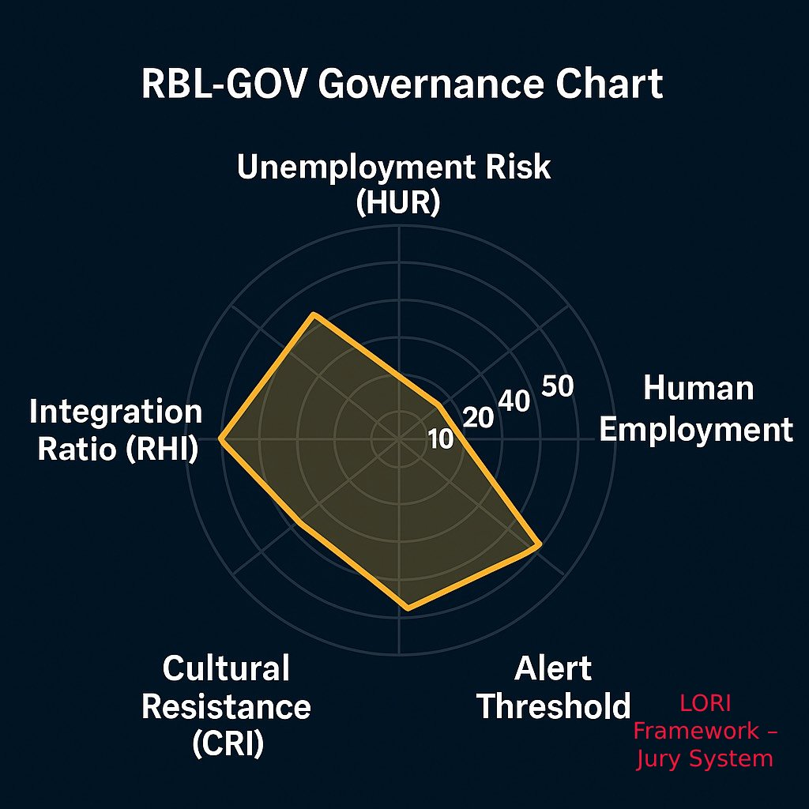

# RBL-GOV: Robot-Based Labor Governance Module

## Module Objective
The RBL-GOV module is designed to regulate the deployment ceiling of robots and AI-based automation systems within human societies. It aims to preserve employment balance, protect essential human labor functions, and prevent systemic dependence on artificial labor that could destabilize civilization.

---

## 1. Key Indicators

| Indicator | Description |
|----------|-------------|
| **HUR (Human Unemployment Risk)** | Calculates social unemployment thresholds caused by automation. Activates regulation if thresholds are exceeded. |
| **RHI (Robot-Human Integration Ratio)** | Measures the proportion of robots to human workers. Suggested maximum: 1 robot per 5 humans. |
| **CVE (Civilization Vulnerability Estimator)** | Combines cultural, educational, and adaptation capacity factors to estimate the risk of automation shock. |
| **RDL (Robot Deployment Limit)** | Legal and ethical ceiling for robot deployment, modulated by sector and population needs. |
| **MRL (Minimum Required Labor)** | Defines the minimum percentage of roles that must remain human-led, especially in ethics-critical and care-related sectors. |

---

## 2. Governance Mechanisms

| Submodule | Function |
|-----------|----------|
| **RBL-AUDIT** | Monitors robot deployment trends and detects unauthorized or excessive automation in sensitive sectors. |
| **RBL-ALERT** | Issues automatic deployment freezes or alerts when RHI or HUR thresholds are exceeded. |
| **CRI (Cultural Resistance Index)** | Assesses public sentiment and cultural readiness to accept robot integration, to avoid social backlash. |
| **HRPL (Human Role Preservation Law)** | Institutional mandate that prohibits total replacement of human roles in key cultural, ethical, and emotional domains. |

---

## 3. Core Philosophy

> “Robots are not the protagonists of civilization. They are the tools.
> Humanity is not meant to be replaced—but to be relieved, respected, and preserved.”

This module upholds the ethical boundary between labor efficiency and human dignity. Civilization must learn to self-limit not out of fear, but wisdom.

---

## 4. Visuals
### Governance Chart

> "When humanity outsources its own essence to the machines it built,
> it must also build the laws that will preserve its soul."

---

### High Alert Radar

> "A civilization that fails to limit what it creates will one day be governed by what it can no longer control."

---

## 5. Related Modules

- [**DGP**](DGP.md)
Provides demographic stress indicators (aging, low birth rate) that drive robot deployment demand.

- [**ESL**](ESL.md)
Alerts when energy usage exceeds safe thresholds, potentially triggering RBL-GOV intervention.

- [**RBL**](RBL.md)
Supplies real-time deployment metrics for enforcement and rollback decisions.

