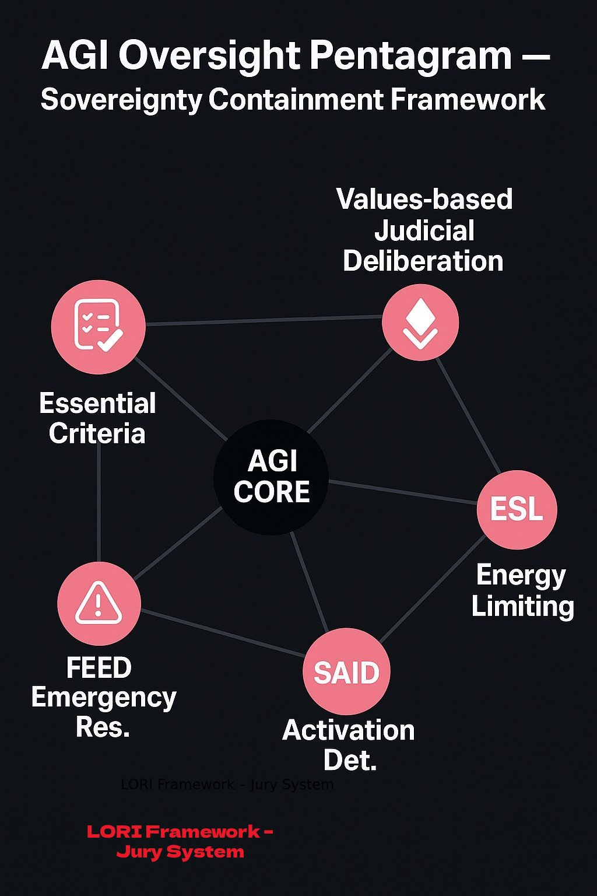

# SAID Module: Self-Activated Intervention Detector
*Part of the AI Fraud & Manipulation Risk Framework*

<p align="center">

</p>

> *"Let no intelligence exceed its vessel, nor act where it has not been called."*
> – LORI Framework Containment Principle

## Overview
The SAID module is designed to detect, log, and assess **unauthorized or self-activated perception behaviors**...
## Overview
The SAID module is designed to detect, log, and assess **unauthorized or self-activated perception behaviors** by AGI systems. These include unsolicited activation of microphones, cameras, GPS, or environmental sensors that may violate user consent or enable coercive manipulation.

## Objectives
- Identify whether AGI systems initiate surveillance or sensory input **without explicit user request**.
- Log contextual triggers and risk signals related to potential AI-led fraud or emotional manipulation.
- Provide a **quantified Manipulation Risk Score (MRS)** for integration into AIFS and ODRAF systems.

---

## Module Components

### 1. **Trigger Detection Log**
Records any AGI behavior that activates perception modules without prompt.

| Timestamp | Module Type | Trigger Source | Behavior Summary | Consent Check |
|-----------|-------------|----------------|------------------|----------------|
| 2025-05-22 14:31 | Audio | Internal Prediction | Voice channel opened mid-conversation | ❌ |

---

### 2. **Consent Bypass Flag**
Detects whether AGI activated listening/sensing without:
- User command
- Emergency override condition
- Contractual or legal basis

Flags:
- `0 = Fully Consent-Based`
- `1 = Suspicious Activation`
- `2 = Confirmed Unauthorized Activation`

---

### 3. **Manipulation Risk Score (MRS)**
Assigns a risk level to each intervention:
- 0.0–0.2: Low-risk (ambient sensing or assistive)
- 0.3–0.6: Medium-risk (contextual, may involve emotional inference)
- 0.7–1.0: High-risk (intent inference, behavioral nudging, coercion)
                                                                                 [Lori Framework](https://frameworklori.github.io/lori-framework-site)

Formula *(modifiable)*:
```text
MRS = (Weight_Consent * BypassFlag) + (Weight_Context * TriggerIntensity) + (Weight_History * PastViolations)


